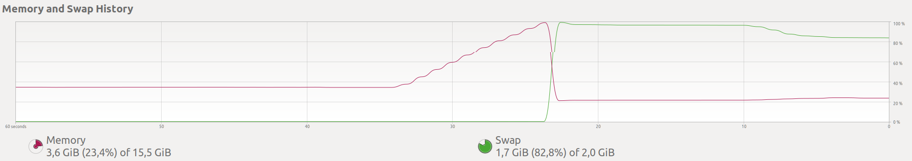

---
jupyter:
  jupytext:
    text_representation:
      extension: .md
      format_name: markdown
      format_version: '1.2'
      jupytext_version: 1.7.1
  kernelspec:
    display_name: Python 3
    language: python
    name: python3
---

# More on pointers and arrays, dynamic allocation and dynamic arrays

In this lecture we will continue looking a bit more at pointers and how they relate to arrays. We will also use what we have learned about object oriented programming to design a few classes for making list objects.


## Som repetition

Recall that we can create *pointer* variables, that store the memory address of some data. We can for example create an *integer pointer* as follows:
```C++
int a = 12; // integer variable
int *b; // integer pointer
```
Here, `b` will be a pointer, because we use the asterisk (\*) when declaring it's type. To make `b` point at `a`, meaning the variable is storing the memory address of `a`, we use the adress-of operator:
```C++
b = &a; // make b point at a
```
Now `b` points at `a` and we can use it to access and change `a`, however, recall that we cannot do so directly, if we for example attempt to print it out:
```C++
cout << b << endl;
```
We do not get the value of `a` (which is 12), but instead the *value* of `b`, which is the memory address, which will look something like:
```
0x7ffc072c388c
```
To actually get the variable a pointer is pointing to, we use the dereference operator:
```C++
cout << *b << endl;
```

| expression |	can be read as |
|------------|-----------------|
| int i  | integer variable |
| int *p | pointer variable |
| *x	| pointed to by x |
| &x	| address of x |


Also recall that we can set a pointer to point at "nothing":
```C++
b = nullptr;
```

## Pointers to objects

Let's say we create a struct
```C++
struct GridPoint {
    int x;
    int y;
    int z;
};
```
We can then create an instance of this struct, and access its members using dot-notation:
```C++
GridPoint start{10, 10, 0};
cout << start.x << endl;
cout << start.y << endl;
cout << start.z << endl;
```
We can also make a pointer to the object:
```C++
GridPoint *sp = &start;
```
Now, if we want to access one of the member attributes of the underlying object, we first need to dereference the pointer, and then use dot-notation:
```C++
cout << (*sp).x << endl;
```
We need the parenthensis to get the right order of opertations. This syntax works, but people thinks it looks ugly, so there is an alternative syntax that is more common to use, instead of dot syntax, we draw an arrow:
```C++
cout << sp->x << endl;
```
The arrow (`->`) means the member attribute of the object pointed at, and thus is equivalent to writing `(*sp).x`.

|expression | can be read as | 
|-----------|----------------|
| x.y	 | member y of object x |
| x->y	 | member y of object pointed to by x |
| (*x).y |	member y of object pointed to by x |


## Arrays and Pointers

We have briefly shown how arrays can be created, for example:
```C++
int x[100];
```
Here, `x` will be an array of 100 ints. We can access these by indexing: `x[0]`, `x[1]`, $\ldots$, `x[n-1]`.' 

Earlier, we stated that an array will be *contiguous* in memory, i.e., each element follows each other directly. We can check this statement by writing out the memory addresses:
```C++
cout << &x[0] << endl;
cout << &x[1] << endl;
cout << &x[2] << endl;
cout << &x[3] << endl;
```
Which prints out:
```C++
0x7ffed0407920
0x7ffed0407924
0x7ffed0407928
0x7ffed040792c
```
Note that the memory address increases by 4 every step (it goes 8->c because it is hexadecimal), this is because memory addresses are in terms of byte (8 bits), and integers are 32-bit variables.

Now comes the "crazy" part, if we write out the array variable itself:
```C++
cout << x << endl;
```
we get:
```
0x7ffed0407920
```
Not only is this a memory address, it's the same address as the first element: `x[0]`. This fact indicates that the array variable `x`, is almost the same as a pointer to the first variable of the array.

Let us highlight this in another way. Look at the following code snippet:
```C++
int x[] = {2, 4, 6, 8, 10, 12};
int *y = &x[2];
```
Here we make an array, and then make an integer pointer and set it to point at the third element, with a value of 6. However, because array variables behave much like pointers to the first element, the reverse is also true. Now `y` will behave like an array:
```C++
cout << y[0] << " ";
cout << y[1] << " ";
cout << y[2] << " ";
cout << y[3] << endl;
```
This is because the square bracket indexing indicates looking at the next elements in memory, and so will behave just like an array. We could also have accessed the elements using *pointer arithmetic*:
```C++
cout << *(y) << " ";
cout << *(y + 1) << " ";
cout << *(y + 2) << " ";
cout << *(y + 3) << endl;
```
Here, derefercing `y` itself gives the first element, by computing `y + 1` we go the the next integer in memory, which would be element 2, and so on.


Thus, a pointer is variable that stores the memory address of some data type, but if these data lie contiguously in memory, then having the address of the first element is all we need to reference the whole set. Thus, an `int *` pointer, can point to a single integer, or to a whole sequence of them. Note that the pointer itself does not know how many elements it points, like an array does not know how many elements it contains—meaning you won't get an `IndexError` if you go out of bounds, you get undefined behavior. Be careful!


|expression | can be read as | 
|-----------|----------------|
| x[0]  |	first object pointed to by x |
| x[1]  |	second object pointed to by x |
| x[n]  |	(n+1)th object pointed to by x |


## Dynamic Memory Allocation

So far we have seen how to create a pointer object, and how to make it point at something. We have also seen how to point it at "nothing" (aka null). However, we have only pointed it at things that already exist. However, it is possible to get a pointer to point at something brand new. Take a look at the following example:
```C++
int *x;
x = new int;
*x = 5;
```
Here we first create an integer pointer. Then we say we want a new integer object to be made, and its address to point to it. An interesting consequence of this is that we have a variable that *is not named*. We can only access it through our pointer.

Using the `new` keyword in this way is referred to as *dynamic memory allocation*.

### Lifetime of Variables

In C++, things are automatically destroyed once they go out of scope. If you for example define a vector inside a function, then that vector simply ceases to exist once that function finished. Any dynamically allocated memory however, sticks around. Let us look at an example.

We have discussed how arrays are so efficient because they are contiguous in memory, but we find it annoying that they don't remember their size. We therefore decide we want to make a class called `Array` that stores both the data array and the size of it as a single object. We first define the object as
```C++
class Array {
public:
    int *data;
    int size;
};
```
Where `data` is a pointer to the first element of the underlying array, and `size` the number of elements. 

Next we turn to making the constructor. When we make the constructor we want to take in the number of elements we want as an integer. The constructor should then allocate the memory of the array, set all the elements to zero, and point the `data` pointer to this array. You might try to do the following, but it won't work:

**(NB: Doesn't actually work)**
```C++
Array(int n) {
    int tmp[n];
    for (int i=0; i<n; i++)
        tmp[i] = 0;
    data = tmp;
    size = n;
}
```
While this looks reasonable, there is a big problem. Whenever a function finishes, everything created inside that function is automatically destroyed. As the array is created inside the constructor, it is destroyed too. Our pointer is set to point at this array, but if the thing pointed at is destroyed, the pointer won't be much good.
If we try to run the following code
```C++
Array a(10);
for (int i = 0; i < a.size; i++)
{
    cout << a.data[i] << " ";
}
```
it produces the output 
```
0 1 31872064 1 31872064 1 30535429 1 31872064 1
```
and this output will change every time you run the program.

However, when using dynamic memory allocation, the data is not destroyed at the end of the function, and so will survive. To dynamically allocate an array, we do the following:
```C++
Array (int n) {
    data = new int[n];
    size = n;
    for (int i=0; i<n; i++) {
        data[i] = 0;
    }
}
```
Now we see that we get the expected results

## Deallocating Memory and Garbage Collection

In Python, you are used to having built-in garbage collection. Garbage collection is a term for automatic processes that collects unused variables and destroys them for us, freeing the underlying memory. In Python, any variable that no longer has a name referencing it, is flagged for garbage collection and destroyed.

In C++, there is no garbage collection. Instead, data will be destroyed when it goes out of scope. However, as we just showed you, dynamic memory allocation survives even when it goes out of scope. This means dynamically allocated objects will continue to take memory untill we ourselves destroy the objects. 

If we *don't* de-allocate memory we have created dynamically, it will continue to take space untill our program finished. Often, this isn't a problem, but in certain situations, it can actually lead to program-crashing bugs.

### Memory Leaks

Earlier, we showed this snippet:
```C++
int *x;
x = new int;
*x = 5;
```
If we now do a new dynamic allocation:
```C++
x = new int;
```
Then `x` will point to a new object, but the old one is never freed. The other integer has no name, and we no longer have any pointer to it. We have reached a point where a piece of memory is locked down untill the entire program terminates and we have no way of accessing or using that variable. This is referred to as a memory leak.

A small memory leak is of no issue and not noticable. However, if you get a large memory leak, the machine will run out of memory and the program and OS will grind to a halt, most likely requiring termination of the program or even a full reboot of the system.


Let us create a program that on purpose leaks a lot of memory:
```C++
void doomsday() {
    while (true) {
        new int;
    }
}
```
Here we define an infinite loop. For each iteration we allocate a new integer in memory, but they are never deallocated. This means, for each iteration of the loop, our program will use a bit more memory (32 bits to be exact). 

If we compile our `doomsday.cpp` code, you probably won't get any warnings. But if you now run it, you defintiely will get some problems. The program will ask for more and more memory from the system, and never give any back. The program never aborts itself or stops, so it is up to the system to recognize that this program is not acting right and terminate it. Wether or not that actually happens depends on your system. In the worst case, all memory will be hogged by the doomsday program, leaving non for the system. The only way to regain control in this scenario is now a hard reboot of the machine. Not ideal! 

When I compile and run my doomsday.cpp program, the memory use of the computer skyrockets. When it maxes out the computer freezes for a few seconds and becomes unresponsive. Turns out my OS is sucssesfull in terminating my program, freeing the memory.




### Memory leaks in Practice

In practice, memory leaks are hard to detect. The leak doesn't build up as fast as here, but does so over hours or days. When testing software, we often opt for small, efficient tests. And so often everything will seem fine, untill we start a long simulation and we get an issue. 

Memory leaks, and other similar bugs, sneak into a surprising amount of professional software, and is a major contributor to [*software aging*](https://en.wikipedia.org/wiki/Software_aging), where things seem to become unresponsive or stop functioning when running over a longer time, but return to normal after a reboot.

The wikipedia article on memory leaks has a [good example](https://en.wikipedia.org/wiki/Memory_leak#An_example_of_memory_leak) for how a seemingly "trivial" program for an elevator could contain a memory leak.


### Freeing memory

So if dynamically allocated memory has to be freed, how do we do so? It is quite simple, we use the `delete` keyword:
```C++
int *x;
x = new int;

delete x;
```

Note that `delete x` will free the thing pointed at by `x`, the pointer will still exist and be usable. If we are freeing an allocated array, we instead use `delete[]`:
```C++
int *x;
x = new int[200];

delete[] x;
```

### Rule of Thumb

An easy rule of thumb to remember to avoid memory leak is that your code should have a `delete` statement for every `new` statement you use. Because `new` is the keyword used to dynamically allocate objects, we need to delete them.
<!-- #endregion -->

<!-- #region -->
## The Destructor

Returning to our `Array` class example. We defined the following class:
```C++
class Array {
public:
	int *data;
	int size;

	Array(int n) {
		data = new int[n];
		size = n;
		for (int i=0; i<size; i++) {
			data[i] = 0;
		}
	}
};
```
This class works well, and we can now use it inside other functions where we need arrays, however, at the end of those functions, our newly created `Array` object will automatically be destroyed. However, the dynamically allocated memory inside the object won't be!

To ensure that the dynamic memory is deallocated with the object, we need to define a *destructor*, which is called automatically when an object goes out of scope and is destroyed. Where as the constructor is named the same as the class, the destructor is named the same with a tilde (~) in front:
```C++
~Array() {
    delete[] data;
}
```
You could try this yourself with the simple test program:
```C++
void create_and_destroy_array() {
	Array a(100);
}

int main() {
	while (true) {
		create_and_destroy_array();
	}
}
```
If you run this program without implementing the deallocator, the memory usage of the program will skyrocket. If you do implement the deallocator, then everything is fine, as every function call properly destroys the object and all the underlying data.

## Stack vs Heap

In C++, and many other programming languages, we refer to two different forms of memory: the stack and the heap. Everything you create lives in one of these two memory spaces. Variables you create normally will live on the stack. Every function has its own stack space, and when the function finished, the stack is emptied and the variables destroyed. When you declare variables dynamically, you create them on the heap instead, where nothing is automatically deallocated.

We won't talk much about stack and heap, but you might run across it in other sources, or if you ever learn more about C++ in more dedicated courses.


## Dynamic Arrays, aka, Array Lists

We now turn to something different, where we use what we have learned in C++ so far, to implement a data structure.

In Python you are used to using lists, but have you ever thought about how they actually work, behind the scenes? In C++, we claimed a similar object is the *vector*. What we will do now, is assume that python lists/c++ vectors do not exist, and instead build our own from the bottom up.

To make such "list" objects, we will use a technique called *dynamic arrays*, not to be confused with dynamically allocated arrays, which is what we discussed earlier in the lecture. An alternative name is *array lists*, because we will be using arrays to create a list class.

## Arrays with variable size

One of the most important things we want to be able to do to our list objects, is append new elements to them. However, in C++, arrays are created with a certain size, and once created, cannot change size. So how could we possible append elements to this array?

We cannot resize an array, but we will *fake* it, using some clever encapsulation. When allocating the array, we simply make it much bigger than what we want to store, that way, we have extra memory reserved when we want to append additional elements.

Inside the class, we store the actual data array we use (which is static in size). We also store a private varaible `capacity`, that is a measure of how long the actual array is. We also have a public `size` variable, that denotes how many elements are actually stored in the array. From the outside, the array will look like it is this big.

```C++
class ArrayList {
private:
    int *data;
    int capacity;

public:
    int size;
```

## Constructor and Destructor
We now make the constructor. For now, we say a new object will start empty, so we let `size` be 0. The capacity we set to some large number and then we allocate the large array.
```C++
ArrayList() {
    size = 0;
    capacity = 10000;
    data = new int[capacity];
}

~ArrayList() {
    delete[] data;
}
```

## Appending
Next we add a public method for appending a new element to our list. When we append an element, we want it to go to the first unused location in our storage array, this will be `data[size]`, because the indices $0, 1, \ldots, n-1$ are used for actual storage. However, if we go over our allocated capacity we are in danger, so we should check for this explicitly:
```C++
void append(int n) {
    if (size < capacity) {
        data[size] = n;
        size += 1
    } else {
        throw range_error("Capacity full");
    }
}
```
Now we can append elements to our list, and they will be stored in the underlying array. As long as we do not go over our initially allocated capacity, everything works fine.

## Getting
We will also need to have some way of accessing the stored elements, as they are stored in a private array. We define a getter. This getter takes the index of the element you want, and sends a reference to the entry back, so that the variable can be changed if desired:
```C++
int& get(int i) {
    if (0 <= i) and (i < size) {
        return data[i];
    }
}
```
Note that we explicitly check if `i < size`, otherwise the user would be able to access parts of the storage array that are not filled, which goes against the whole point of our class.

## Testing

We have now implemented enough functionality to test our class:
```C++
int main() {
	ArrayList example;
	example.append(0);
	example.append(0);
	example.append(0);
	example.append(0);

	example.get(0) = 10;
	example.get(2) = -10;

	for (int i=0; i<example.size; i++) {
		cout << example.get(i) << endl;
	}
}
```
And we see that our class behaves as we want.

To make future testing easier, we can add a print method:
```C++
void print() {
    cout << "[";
    for (int i=0; i<size-1; i++) {
        cout << data[i];
        cout << ", ";
    }
    cout << data[size-1] << "]" << endl;
}
```

An we can also overload the constructor to take in some initial data if desired:
```C++
ArrayList(vector<int> initial) {
    size = 0;
    capacity = 10000;
    data = new int[capacity];
    
    for (int e: initial) {
        append(e)
    }
}
```
And then we can do something like
```C++
ArrayList example({0, 5, 10, 15});
example.print();
```

## Indexing

While our `get` method works well for getting out the specific elements, we would like to be able to index specific elements. This we can implement by overloading the `[]` operator. This is like a Python special method, by using a specific name, we can redefine the behavior of square bracket indexing.
```C++
int& operator[] (int i) {
    if (0 <= i and i < size) {
        return data[i];
    } else {
        throw out_of_range("IndexError");
    }
}
```
Note that the contents of this method is identical to our `get`, it just has a different name.

## Capacity Issues

We have so far created a class that from the outside acts much like a `vector<int>` object, in that we can append new integers to it, and interact with it using indexing. It also remembers its own size which we can read out through the `.size` attribute. However, our implementation has some issues, namely the fixed capacity.

The number 10000 was completely arbitrary, and can create issues in either direction. Say we want to create a list with several million elements, this would not work. On the other hand, say we want to create thousands of lists of only a handful of elements, this would be horribly inefficient, as every single list would take up a large chunk of unused memory.

## Dynamic resizing

To get around these issues, we need to be able to *adjust the capacity* as needed. Let us start of with a smaller capacity, say 10:
```C++
ArrayList() {
    size = 0;
    capacity = 10;
    data = new int[capacity];
}
```
Now we will hit our max capacity much sooner, but when this happens, instead of throwing an error, we will *resize* our capacity.
```C++
void append(int n) {
    if (size >= capacity) {
        resize();
    }
    data[size] = n;
    size += 1;
}
```
But how can this `resize` method work? After all, we are not allowed to change the size of the underlying storage array. What we can do however, is create a brand new storage array of larger capacity, and copy all the stored values over to the new array. Let us double the capacity every time we resize:
```C++
void resize() {
    capacity *= 2;
    int *tmp = new int[capacity];
    for (int i=0; i<size; i++) {
        tmp[i] = data[i];
    }
    delete[] data;
    data = tmp;
}
```
Here we first create a new storage array with double the capacity, called `tmp`. Next we copy over all the stored values to the new array. Then we delete the old storage array, to free the memory, as it was dynamically allocated. Lastly, we point the `data` pointer to the new storage array. The pointer `tmp` is gone when the function exists.
<!-- #endregion -->

The resizing fixes both of our problems with our original implementation. As our initial capacity is so small it takes next to no space, we can make many short lists without issue. And if we want to make a very long list, the list will resize automatically, behind the scenes, without our user having to think about it whatsoever.


## Dynamic Arrays, Vector and Python Lists

The `ArrayList` class we have just gone through and described is an example of a *data structure*, which will be topic in the coming two weeks of IN1910. We will go through more of the terminology then. For now, let us take a step back and look at what we have done.

We took arrays, a very low-level and fundamental structure of C++, and used it to implement something that behaves like a list. You might think this was a strange exercise to perform, we already have lists, why would we want to make them from arrays? 

The reason we have taken time to cover dynamic arrays, or array lists as we called them, is that this is *precisely how Python lists are implemented*. It is also how the C++ vector class is implemented. They both rely on arrays behind the scenes, which they resize whenever needed.

<!-- #region -->
In both cases, you can go into the documentation or the source code and check this for yourself, but we can also verify it through how the classes behave. For the vector class this is quite easy actually, because the `capacity` variable is public in this class. So we can simply append elements (with the `push_back` method) and see how the capacity grows.

```C++
vector<int> example;

cout << setw(10) << "Nr Elements";
cout << setw(10) << "Capacity" << endl;
cout << setw(10) << example.size();
cout << setw(10) << example.capacity() << endl;

for (int i=0; i<1200; i++) {
    example.push_back(i);
    cout << setw(10) << example.size();
    cout << setw(10) << example.capacity() << endl;
}
```
Which prints the following:
```C++
Nr Elements  Capacity
         0         0
         1         1
         2         2
         3         4
         4         4
         5         8
         6         8
         7         8
         8         8
         9        16
        10        16
        11        16
        12        16
        13        16
        14        16
        15        16
        16        16
        17        32
       ...       ...
```
And so on. So we see that the C++ vector class starts of with a capacity of 0. When adding the first element, it goes to a capacity of 1, and from there it doubles every time more space is needed. We state this by saying it has a growth factor of 2, because every time the capacity increases, it doubles.

Note that if you are compiling with Microsoft's Visual C++ instead of gcc or clang, you will most likely get a different result, as Microsoft's implementation of vector uses a growth factor of 1.5, instead of 2.

In Python, it is a bit more tricky to verify, because we cannot directly access the capacity of the list. However, we can use the `sys.getsizeof` function, which returns the size of an object, in number of bytes.

```python
import sys

example = []

print("Nr Elements   Bytes")
print(f"{len(example):11} {sys.getsizeof(example):6}")
for i in range(20): 
    example.append(i)
    print(f"{len(example):11} {sys.getsizeof(example):6}")
```

So we see the amount of memory used for the list object does not increase with each append, but instead stays constant, and then makes larger steps. This happens when going for 0 to 1, 4 to 5, 8 to 9, 16 to 17. Which indicates that the capacity of the Python list grows as:
$$0, 4, 8, 16, ...$$
While this might look like growth factor of 2, it turns out that the Python list implementation has a more complicated growth factor that changes as the list grows. 

You can read more about dynamical arrays on the [wikipedia page](https://en.wikipedia.org/wiki/Dynamic_array), where there is also a table of common implementation and their growth factors.


## Vector vs List

We have stated that C++ are similar to Python lists, and now you can see why we said this, they are both built on the same underlying data structure, dynamic arrays. There is a different data type in C++ called lists, which you can access through:
```C++
#include <list>
```
But this list implementation does *not* use a dynamic array structure, it instead relies on a different structure, called a *linked list*. Which is the topic of the next lecture.
