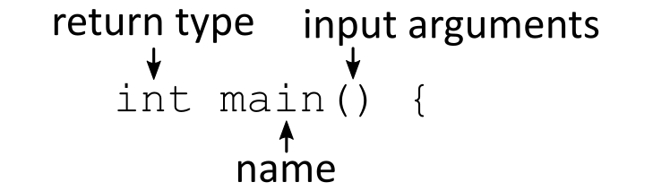

---
jupyter:
  jupytext:
    text_representation:
      extension: .md
      format_name: markdown
      format_version: '1.2'
      jupytext_version: 1.7.1
  kernelspec:
    display_name: Python 3
    language: python
    name: python3
---

# An introduction to C++

This week we will start to turn to a new programming language, C++. We will use this language, in combination with Python, for the rest of the course. You will learn how to read and write short C++ programs, and how to compile and run them. Our goal is to make you at least somewhat familiar with C-style code, and also to make you aware of the major differences between Python and C++. Note however, that the world of C++ is big, and to get proficient at C++ one has to dedicate a lot of time and effort to it, certainly more than we have time for in IN1910. The goal is therefore to give you a taste of the language and an overview that can come in handy down the road.

C++ is a hard language to learn, and also a hard language to use. There is a joke in the programming world, that everyone should learn C++ as their first language, because after that any other language will seem easy. While that might be an exaggeration, it is definitely a more technical language than Python. The best piece of advice we can give you before we start is simply: *don't panic*. We don't expect you to become experts in this course, and so the goal is more that you can write some cool programs, rather than take away all the fundamentals.

## A Python to C++ transition guide 

The book *Object-Oriented Programming in Python*, written by by Michael H. Goldwasser and David Letscher 
has a supplemental document called *A Transition Guide from Python 2.x to C++*. Both the book and supplement are freely available as pdf-files on the [book's website](http://cs.slu.edu/~goldwamh/oopp/). The supplement is ~90 pages, and covers most of what we will use in this course. It can be a good document to work through if you prefer reading on your own above lectures. The supplement is written for Python 2, but the differences are so small, this should be of no big concern.

[Direct link to *A Transition Guide from Python 2.x to C++* by Goldwasser and Letscher](http://cs.slu.edu/~goldwamh/publications/python2cpp.pdf)

### The definitive C++ book guide and list

If you want a dedicated C++ book, there exist many out there. I would recommend reading through StackOverflow's [Definitive C++ Book Guide and List](https://stackoverflow.com/questions/388242/the-definitive-c-book-guide-and-list) to find one that is worthy of both your time and money.

## Why C++?

So why are we learning C++ as our second language? 

C++, like many other languages, is based on C. C is an old language, created in 1972, but still sees wide use today. It is a low-level language that compiles into highly efficient machine code—put simply, C is blazing fast. While C is important historically, it is still one of the most used languages today. A lot of much used software, such as UNIX and the main implementation of Python, is written mainly in C. 

C++ is a direct extension of the C programming language, with the motivation of adding classes to the language. The syntax and semantics of the two languages are therefore nearly identical. The major difference is that C++ has larger standard libraries and more support for higher level constructs, such as object-oriented programming. C++ still retains most of the low-level features of C however, and if implemented correctly, will be highly efficient and fast.

Several other popular languages are also, at least partially, based on C, such as C# and Objective-C. Other languages, like Java, borrow most of their syntax from C. While Java is very different "under the hood", and runs quite different from C, the code itself looks quite a bit alike. In short, many, many languages today have a strong "C-flavor" to them, and dedicated programmers are more or less expected to know some C-style language.

So to summarize: We want to learn a C-style language, because it is extremely useful for any programmer to know one of these languages, as it makes learning any of the others a lot easier. We also want to have a highly efficient language, to be capable of making fast and large computations. This requirement means we prefer to choose C or C++ over Java. Lastly, as we are learning object-oriented programming in this course, C++ is the natural choice over C.

Ok. Enough talk, let's get to learning some actual C++!

TODO: Write about C++ standard library

## How to write, compile and run C++ programs

As our first introduction to the language, let us write a *Hello, World* program. Open your favorite text editor and create a new file called `hello_world.cpp`. 

Here, you can already note that `.cpp` is a file extension for C++ source code, i.e., the file we write the code itself. This is only one possible file extension, and other common ones are `.cc`, `.cxx`, or `.c++`. We stick with `.cpp` in this course.

Also note that some people advocate using IDEs for C++ (such as Qt Creator), and for larger projects, this can be very helpful, as we need to link many different files, which an IDE can help with. In this course however, we will stick mainly to single file C++ programs, and so getting a dedicated C++ IDE is not necessary.

<!-- #region -->
## Your first C++ program
Before you start writing any C++ code and try to compile and run it, make sure that you have read through the [C++ installation guide](../../setup/cpp_compiler.md)

In our fresh file, we enter our *Hello, World* code. Which will look something like the following:

***
```C++
#include <iostream>

int main() {
    std::cout << "Hello, world!" << std::endl;
    return 0;
}
```
***
Before we cover how to compile and run this code, let us read through and analyze what it does.

The program starts out with an `#include` statement, which is like importing files in Python. This statement means we are including a so-called *header file* (more on headers later). Here we include the standard header `iostream` (input-output stream). We need to include this header to be able to output our message.

Next we define a function named `main`. In C++, we have to define a *main function*. Executing the program is the same as calling this function. It has to be specifically named `main`, or you will get an error. We write `int main()` because our function *returns an integer*, is named *main*, and takes no input. The contents of our function go between two curly braces (`{` `}`). 


<center><b>Figure 1:</b> Declaring the <i>main</i> function of a C++ program.</center>

Inside our main function, we do two things:
1. we write out our message, 
2. we return the integer 0. 

When we write out our message we use `std::cout`, this isn't the only way to print in C++, but it is the recommended way. Here, `std::cout` is an *output stream*, and anything we insert into this stream will be written out. We insert things using double angel brackets (`<<`). We then write out our message as a text string, using `"` as delimiters (In Python we use `"` and `'` interchangeably, but in C++ `"` denote string literals, while `'` denote single character literals). We have to end each statement in C++ with a semicolon (`;`), so we end our output line with a semicolon.

Writing `cout << a << b` just outputs the two things in order, so here we first insert our message, and then `std::endl`. Here *endl* stands for *end line*, and is basically just a newline character. An alternative to inserting `std::endl` would have been to just write in a newline character in our string: `"Hello, world!\n"`. (There is a subtle difference between using `endl` and `\n`, you can read about it on [StackOverflow](https://stackoverflow.com/questions/213907/c-stdendl-vs-n) if you are curious).

We write `std::` because we are using variables that come from the `iostream` header, and this is a *standard* header, and so `std::` means we are accessing something contained in the `std` namespace. If we import from other packages, we would need a different namespace, such as `arma::` (for the [Armadillo libraries](http://arma.sourceforge.net/)) or `boost::` (for the [Boost libraries](Boost C++ Libraries)). In most of our programs, we won't use that many packages, and we will mostly stick to standard headers, which in turn means we will write a *lot* of `std::`, which is a bit annoying. What we can do to avoid this is to declare `using namespace std;` at the top of our program. This tells the compiler that when we call a function, it will look for the given function in the `std` namespace, and so we can replace `std::cout` with just `cout`, and so on. For our `hello_world.cpp` script, this doesn't help that much on tidiness, but in larger codes, having a single declaration instead of dozens of `std::` can be preferable.

Finally, we return `0` from our main function by writing `return 0;`, the same as in Python except for the fact that we need to end our statement with a semicolon. After returning, we are done with our function declaration, so we include our closing curly brace (`}`). Why do we return 0? Recall that our main function is the function that is called by the system when we want to execute our program. When the program finishes, we should return something to the system so that it knows the program is finished. It is customary to return an integer, and we return 0 if the program terminated successfully. If the program aborted or crashed, we return any other integer. Depending on what caused the erroneous termination, we can return a different number, which would be an *error code*, that can tell the system something about what went wrong. We won't use these much in this course, simply put, we always return 0 at the end of our main function, and if something goes wrong, we will instead raise an exception.


## Compiling and Running C++ programs

We have now written and analyzed our C++ code, but how do we actually run it? Here, things will be quite different from Python, because C++ code first needs to be *compiled* before we can run it. 

### Interpreted vs Compiled Languages

One of the major differences between Python and C++ is that Python is an *interpreted* language, while C++ is a *compiled* language. When we write a Python program, our source code, and our program, is one and the same. To run our program we invoke the Python interpreter, which reads our code and executes it as it goes.

For C++ programs however, we write our code to a file, but this file cannot be executed directly. Instead we have to turn our source code into an executable program, and this step is known as *compiling the code*. We compile code by invoking a C++ compiler that reads our code. However, unlike the Python interpreter, the compiler doesn't execute our code, instead it translates it into low-level executable machine code, making sure to specialize our code to the system we are compiling on. What we end up with is an *executable*, a program we can execute to run. This program is now executed directly by our machine, and we don't need to invoke a separate "C++ interpreter", as the code has already been translated to codes the machine can understand.


Most editors and IDE's have some functionality to compile (also called building) C++ source code into executables. And learning these could be good for your workflow. However, it is still important to learn how to do it "manually" in the command line as well.


If you are on a UNIX system (Linux/Mac OS), then you will most likely use the GNU compiler (called GCC). This is one of the main C++ compilers. On Windows, you can also use GNU (through for example Cygwin), but perhaps more common is to use Visual C++. Many other C++ compilers exist. 

This week's exercises will tell you more about installing a C++ compiler if you do not already have one installed.


### How to compile your program

We will now compile our C++ code by invoking our compiler in the terminal. For our examples, we will be using the GCC compiler, if you are using a different compiler, the commands will change slightly, but it should largely be the same. 

TODO: Use `c++` command instead of `g++`. 
TODO: Talk about Clang and GCC.
TODO: Write about how you can do this in VSCode

Using GCC, we invoke the C++ compiler in the terminal by writing `g++`, we must also supply it with what source code that should be compiled, so we write:
```
g++ hello_world.cpp
```
Note that `gcc` is also a program you can invoke in the terminal, but this is the GNU C compiler, *not* the C++ compiler, and so the command will most likely crash if you try to use it on C++ code.


### Executing your program

When we run `g++` to compile our code, the compiler tries to analyze the code and creates an executable. However, we have given no name for our executable, and so it defaults to the filename `a.out`, which is the name of our program.

To run the `a.out` executable, we simply invoke it directly
```
./a.out
```
And running this program, if everything is done correctly, give us the expected *"Hello, world!"* output.

Note that you can get errors in both the *compilation* of the program, and *in the execution*. The compiler might protest and abort when compiling the source code, in which case we get no executable. Or the compiler might execute without any issue, but when running the source code, we get some error. This is because the compiler tries to catch errors, and will catch syntax errors and the like. However, some errors are not found by the compiler, and these might sneak into our executable.

### Naming executables

The name `a.out` is generic and not very descriptive. To improve this, we should compile our program into an executable with a specific name. We do this by adding an output-flag: `-o name`, where you can name the executable whatever you want: so for example:
```
g++ hello_world.cpp -o hello
```
Would create an executable called `hello`, which we would run directly in the terminal:
```
./hello
```
Note that we don't give this executable any file ending. This is very common for executables on UNIX machines. On windows, they are often given the ending of `.exe`, short for *executable*.

Note also that the output name can also be put before the source code:
```
g++ -o hello hello_world.cpp
```
The order is just personal preference.

### Other compiler flags

We can also add other flags to the compiler to give it special instructs or extra information, and we will return to this later. A common one to include is `-Wall` (for "Warning all") that tells the compiler to give us warnings if it sees things it is skeptical about. So we would do
```
g++ hello_world.cpp -o hello -Wall
```
Note that *warnings* in this context is not the same as an *error*. An error causes our compilation to terminate, while with warnings, we do get an executable, but the compiler believes we are doing something that is inefficient or error prone. Ironically, `-Wall` doesn't give all possible warnings, so you could add `-Wextra` to get some more warnings (and other `-W` flags, there are quite a lot possible for specific purposes). 


If you haven't, this is a good time to go through and make your `hello_world.cpp` source code, compile it into an executable, and then run the executable. 

## Static vs Dynamic Typing

One of the major differences in C++ and Python that you will have to learn right away, is that C++ is *statically typed*, while Python is *dynamically typed*. 

This means that we have to specifically declare what types our variables are when we define them in C++, and a given variable cannot change it's type. In Python however, we just declare our variables, and let the interpreter figure out implicitly what types the variable is, and a given variable can change types without any problems.

For example

````{tab} Python
```python
city = "Oslo"
year = 2018
temp = 42.3
```
````
````{tab} C++
```c++
string city = "Oslo";
int year = 2018;
double temp = 42.3;
```
````


Note both that we are explicit in our typing in C++. Recall also that we always need semicolons at the end of a statement.

The common primitive data types in C++ are:

| C++ Type | Description  |
|----------|--------------|
| `bool`   | Boolean      |
| `short`  | 16-bit integer |
| `int`    | 32-bit integer |
| `long`   | 64-bit integer |
| `float`  | 32-bit floating-point |
| `double` | 64-bit floating-point |
| `char`   | single character |
| `string`   | character sequence |

Note that these types are different from the ones you are used to in Python. In C++ for example, the type `float` has 32-bits precision, while a `double` has twice that (64-bit). For scientific applications, we want the extra precisions of doubles, and will usually only use doubles, and skip the floats altogether. Note that the `float` type in Python is actually a double, as it has 64-bits precision.

Similarly, the integer type in C++, has a fixed precision of 32 bits, which means it has a built in lower and higher limit to what number it can contain. This is again different from the `int` type in Python, which has no such limit, and can grow larger and larger without any problem.

Note also that the `string` type in C++ has to be imported from the standard library header by the same name:
```C++
#include <string>
using namespace std;
```

## Functions and Types

It is not just when we are defining variables we need to be explicit in our typing, but also when defining functions. For each function we define, we have to explicitly state what types the input to the function are, and what types the outputs are.

Say for example we are making a Celsius to Fahrenheit conversion function, it could be done as follows:
```C++
double F2C(double F) {
    return 5*(F-32)/9;
}
```
Here, we write `double F2C(...)` to state that we are creating a function `F2C` that will return a double, and we also specify `(double F)` to state that it takes a double as an argument. The contents of the function itself is put inside curly braces. To return we use the `return` keyword.

Similarly, if we want to create a function `is_prime`, that takes in an integer, and returns true or false, then we would write 
```C++
bool is_prime(int n) {
    ...
}
```
This statement is called the *signature* of the function, and it tells us quite a bit about how the function works. The combination of a good function name and typed input and output should give the reader a good understanding of what the function does.

What do we do if we want to make a function that returns nothing? Then we define it as a `void`, which simply means it doesn't return anything:
```C++
void greet(string name) {
    cout << "Hello there " << name << "!" << endl;
}
```

***

A full program that defines and uses the `F2C` function can look as follows:
```C++
#include <iostream>

using namespace std;

double F2C(double F) {
    return 5*(F-32)/9;
}

int main() {
	double temp = 110.;
	cout << temp << " F" << endl;
	cout << F2C(temp) << " C" << endl;
	return 0;
}
```
Here we first define our `F2C` function, and then define our `main` function.


## Loops and if-tests

Let's turn to how to create loops in C++. The most common loops in Python are the loops using *range*. Let us look at a simple example written out in both languages:


````{tab} Python
```python
for i in range(10):
    print(i*i)
```
````
````{tab} C++
```c++
for (int i=0; i<10; i++) {
    cout << i*i << endl;
}
```
````


In both languages, we use the `for`-keyword to define a for-loop. However, we define the loop itself quite differently. In C++ we first state where the loop should start (`i=0`), how long it should keep going (`i<10`) and how it should increment, the step (`i++`). Note that `i++` means an increment, similar to `i += 1`. With this syntax, the for-loop is defined with the same logic as a while-loop. Note also that we have to explicitly type the counting variable `i`, by writing `int i=0` for our start of the loop.

Like for functions, the contents of the loop itself is put inside curly braces.

### If-tests

If-tests in C++ look exactly like in Python, except for some small differences in what symbols are used:

````{tab} Python
```python
if i < 100:
    i *= 2
```
````
````{tab} C++
```c++
if (i < 100) {
    i *= 2;
}
```
````

Note that we: (1) add parentheses around the condition itself, and (2) use curly braces to define the contents of the test (the scope), instead of the colon seen in Python. The indentation is similar in both cases, more on this later.

## Boolean Operators in C++

While the if-test themselves are very similar to Python, the conditions themselves might be a bit different. For one, in Python, you are used to using the boolean operators `and`/`or`/`not`, while in C++ it is more common to write `&&`/`||`/`!` for these respectively. However, the keywords are defined in C++, so use the ones you prefer.

However, be careful when combining conditions in C++, in Python we can use nifty shortcuts like `if lower < x < upper`, but in C++, such an expression will be evaluated as `(lower < x) < upper`, with the first condition evaluating to 0 for false and 1 for true, and so for example, you might think the following test would fail:
```C++
if (3 < 10 < 7) {
    ...
}
```
but it actually passes! Because "(3 < 10) < 7" is the same as "1 < 7", which is true.


### Example: `is_prime`

We now combine a for-loop and an if-test to create the `is_prime` function outlined earlier as online a signature.

```C++
bool is_prime(int n) {
    if (n == 1) {
        return false;
    }
    
    for (int d=2; d<n; d++) {
        if (n % d == 0) {
            return false;
        }
    }
    return true;
}
```
Here, we first check the special case of $n=1$, then we see if any of the numbers in the interval $[2, n)$ cleanly divides the candidate, which we do with the modulo operator. Depending on the input, we return either `true` or `false`. Note that these are specified with all lower capitalization.

To test the function, we make a loop checking the numbers 1 through 11:
```C++
int main() {
	for (int i=1; i<=11; i++) {
		if (is_prime(i)) {
			cout << i << " is prime" << endl;
		} else {
			cout << i << " is not prime" << endl;
		}
	}
}
```

## A note on bracket style

From Python, you are used to whitespace not mattering much, with the exception of *newline* characters and *leading* whitespace, i.e., indentation. In C++, however, whitespace matters even less, and this includes newline characters and indentation. As we always include semicolons at the end of statements in C++, we don't need to use newlines between different statements, and because we use curly braces to define scopes, we do not need to use indentation.

However, while newlines and indentation are not strictly necessary for the code to function, we should use them to increase structure and help readability. But if newlines and indentation doesn't impact the behavior of code, it means we can choose to do these things in different ways, and so it because a style choice. In C and C++ there are many different style choices of indentation, newlines and bracketing, and there is a large [Wikipedia article on it](https://en.wikipedia.org/wiki/Indentation_style) you can read if you are curious.

Without going to much into detail, one major point of contention is whether to place the *opening* brace of a function definition or a control structure on the same line as the control statement, or on a separate line immediately below it
```C++
int main() {
	for (int i=0; i<10; i++) {
        ...
    }
}
```
or 
```C++
int main()
{
    for (int i=0; i<10; i++) 
    {
        ...
    }
}
```
When you are looking at C++ code in books or online, you will see both styles used, it comes down to preference. I prefer the first style, which is called the *"One True Brace Style"* (OTBS/1TBS). I prefer this style because it makes the C++-code look as much like my Python code as possible, and it avoids having blank lines separating the function/loop definition from its contents. Having the closing brace on separate line however, is useful, as this blank line gives some space to the following code.

I recommend you stick to the OTBS style in IN1910. As always, regardless of what style you want to follow, the most important thing is to be consistent in your style.

## Single-statement loops and tests

Another important thing to note about braces in C++ is that in a control structure with a single statement, you can opt to skip the braces altogether. For example:
```C++
if (is_prime(i)) {
    cout << i << " is prime" << endl;
} else {
    cout << i << " is prime" << endl;
}
```
could just as well be written
```C++
if (is_prime(i))
    cout << i << " is prime" << endl;
else
    cout << i << " is prime" << endl;
```
Some prefer to write the latter, because it looks nicer without the brackets. The OTB style states that this shouldn't be done however, because it can easily lead to errors.

If you always use braces, even for single statements, you can always go back and add more statements later, and things will work just as well. If you omit the braces however, when you add the second statement, it actually goes *outside* the control structure. This means the first style is a lot safer and extendable than the second. We therefore recommend that you *always use your braces*, it will save you from bugs that can potentially cost you a lot of frustration and time down the road. I once spent several days finding a bug in my code because I added a second statement to a loop that didn't use brackets, and so now I try to always use brackets.

## While-loops

While-loops in C++ also look a lot like in Python. Just like the if-tests, we put parenthesis around the condition and define the scope using curly braces:


````{tab} Python
```python
n = 1
while n < 10:
    n *= 2
```
````
````{tab} C++
```c++
int n = 1;
while (n < 10) {
    n *= 2;
}
```
````

As we can see, there is close to no difference.


## Vectors

From Python, you are used to using the list datatype. This datatype is not built into C++, but there is a similar datatype, called a vector, available from one of the standard libraries. You include it using:
```C++
#include <vector>
```
(Note that there is also a datatype called a *list* in the C++ standard library, we will return to why we say the vectors are equivalent when we discuss data structures).

One major difference between Python lists and vector objects in C++ is that vector objects must contain elements of the same type. So when we define a vector object, we must not only declare that our variable is of type vector, but we must also define the type of the *elements*. This is done as follows:
```C++
vector<int> primes;
```
Here, we define a variable `primes`, that is of type `vector` with contents of type `int`. The use of `<int>` is called *templating*. 

Note that `primes` vector will start out as an empty vector, we do not need to specify it as being empty, this is implied. If however, we wanted to initialize it with given elements, we could do this as follows:
```C++
vector<int> primes{2, 3, 5, 7, 11};
```
Note that we do not use any `=` for assignment here, this is a minor detail we will return to later, when we turn to OOP in C++.

### Interacting with C++ vectors

As stated, the C++ vector objects behaves a lot like a Python lists, and so we can access and change specific elements using square bracket indexing. C++ also starts indexing at 0, so `primes[3]` refers to the integer `7` in the list of primes initialized above. However, note that you cannot index with fancy slicing as in Python.

To append elements to a vector, use the method `.push_back(n)`, which adds elements to the end of the list. The name comes from "pushing something to the back". To get the number of elements in the vector, use `.size()`. To see other supported methods, see the [reference](http://www.cplusplus.com/reference/vector/vector/).

In Python, we can easily loop over elements in a list:

```Python
for p in primes:
    ...
```
A similar syntax is possible with vectors:
```C++
for (int p: primes) {
    ...
}
```
or alternatively you can simply loop over the indices:
```C++
for (int i=0; i<primes.size(); i++) {
    // do something with primes[i]
}    
```

### Example: Finding primes

Let us look at an example where we define a function that finds the first $n$ primes. To do this, we will use our `is_prime` function, which we defined earlier in this lecture.

First, we need to define the signature of our function. It should return a vector of integers, and take in the number of primes to find, so we write
```C++
vector<int> find_primes(int nr) {
    ...
}
```

Now, inside the function, we first need to define an empty vector, where we can push new primes as we find them. We can then use a while-loop to check `primes.size() < nr` until we have found enough primes.

The whole function becomes:
***
```C++
vector<int> find_primes(int nr) {
	vector<int> primes;
	int n = 1;

	while (primes.size() < nr) {
		if (is_prime(n)) {
			primes.push_back(n);
		}
		n++;
	}
	return primes;
}
```
***
To test our function, we add the following to the main function:
***
```C++
int main() {
	vector<int> primes = find_primes(100);

	for (int p: primes) {
		cout << p << endl;
	}

	return 0;
}
```
***


Compiling the program and running the executable will now write out the first 100 primes.


## Strings

We now turn to string objects. C has a primitive data type called `char`, that is a single character. Strings are sequences of characters, and so to make strings in C, one creates arrays of characters. We will cover arrays in the next lecture, but for now, let us simply say they are sequences, like a tuple. Thus, C has no primitive string datatype, it instead uses the `char[]` datatype (the square brackets denote an array).

In C++ however, a string datatype has been added in the standard library, and is the recommended way to work with strings. Note that the datatype is called `string`, and not `str` as in Python.


<!-- #region -->
To use strings we must include the header from the standard library
```C++
#include <string>

using namespace std;
```
If we do not declare we are using the std namespace, then we can use strings by writing `std::string`.
<!-- #endregion -->

See the full reference on strings to see what functionality the string class adds:
* http://www.cplusplus.com/reference/string/string/
