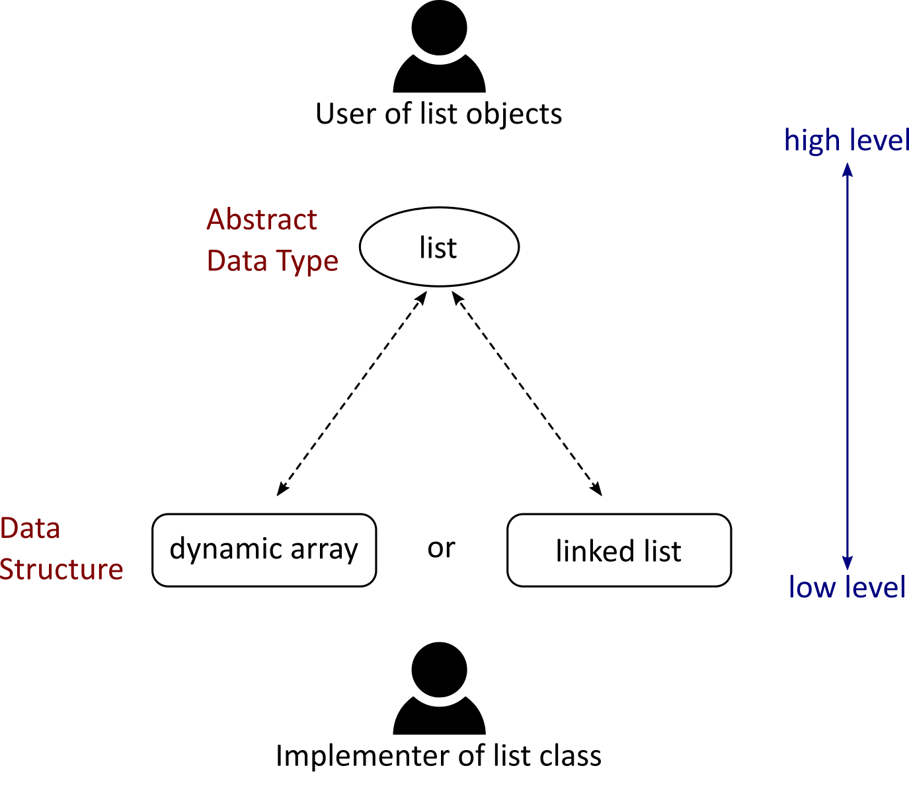
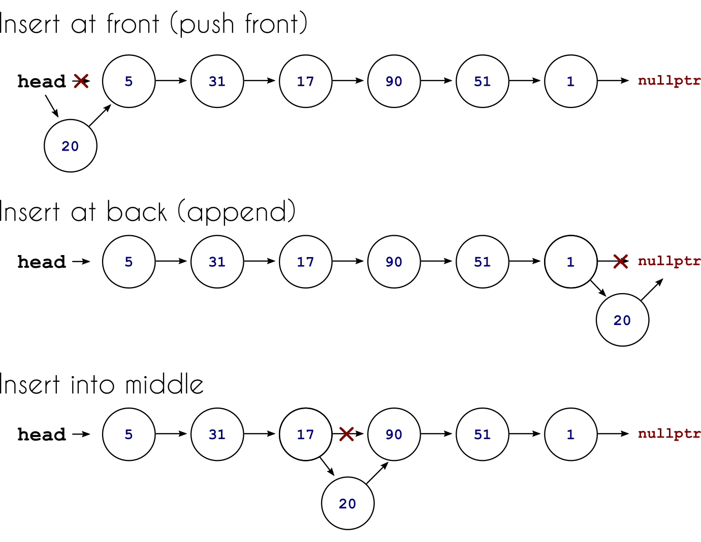

---
jupyter:
  jupytext:
    text_representation:
      extension: .md
      format_name: markdown
      format_version: '1.2'
      jupytext_version: 1.7.1
  kernelspec:
    display_name: Python 3
    language: python
    name: python3
---

# Linked Lists and Algorithm Analysis

This lecture marks the start of a new topic in IN1910, namely the Algorithms and Data Structures part of the course, which we will spend the next two weeks on. We have spent the *previous* two weeks of IN1910 learning some C++. As mentioned, the main goal of learning C++ was to familiarize you with C-style programming syntax. We are through covering new material in C++, but will spend the next two weeks using it for our exploration of data structures, so you will get further possibility to learn to use the language more.

## Data Structures and Algorithms

A data structure is how data is organized and managed. More precisely, it is about how a collection of data items are stored collectively, how they relate to each other, and what operations we can perform on them. Understanding data structures is important when trying to make efficient programs, because different problems and implementations calls for different data structures.

Algorithms are tightly connected to data structures, because to implement a data structure, we need to understand the algorithms needed to get that data structure to work. But also because implementing an algorithm to solve some problem will rely on what data structure you choose to work with, different underlying structures call for different algorithms.

Data structures and Algorithms is one of the fundamental topic of computer programming, and if you want to work as a software developer, you really need to know it. This is reflected in the fact that there are numerous books and university classes called precisely "Data Structures and Algorithms", or alternatively: "Algorithms and Data Structures". We only have a few weeks dedicated to this topic, so it is obvious that we cannot give you a proper introduction into the topic. However, we aim to give you a small taste, and an understanding of what a data structure actually is and why it is important.

## External Resources

At UiO, the course [IN2010 – Algorithms and Data Structures](https://www.uio.no/studier/emner/matnat/ifi/IN2010/index-eng.html) (previously INF2220) focuses more in-depth on the topic, and comes highly recommended for anyone who wants to become a better programmer, and it's pretty much a prerequisite course to take if you want to go further into computer science. Note that IN2010 uses Java as its language, but having learned some C++, the course will build on what we do in IN1910 quite nicely.

As mentioned, there are also hundreds of books on this subject, some probably better than others. Not only are there many to choose from, there are probably several to choose from dedicated for each programming language you might want to use. We will recommend the book used by IN2010, [*Algorithm Design and Application* by Goodrich and Tamassia](https://www.wiley.com/en-us/Algorithm+Design+and+Applications-p-9781118335918) as that is probably the best choice if you want to get a dedicated book and might be taking IN2010 in the future.


Another excellent resource to use are the teaching materials for the [MIT course 6.006 *Introduction to Algorithms*](https://ocw.mit.edu/courses/electrical-engineering-and-computer-science/6-006-introduction-to-algorithms-fall-2011/). The course materials are openly available through Open CourseWare, with recorded video lectures. This course covers the theory behind many data structures and algorithms, and so works well with any programming language, but mostly uses Python for example code. Note that 6.006 goes into many topics we won't cover, but they also have lectures that cover what we do in IN1910.


## Data Structures vs Abstract Data Types

In the previous lecture, L12, we covered [Dynamic Arrays](https://en.wikipedia.org/wiki/Dynamic_array), also known as Array Lists. And this is an example of a data structure, as it is a specification on how data values are to be stored, and interacted with. In that lecture, we implemented a class, and then had to continuously swap to think between how things worked "inside the class", and how they looked from "outside the class", i.e., how the class is actually used.

We now want to formalize these concepts a bit. The term *data structure* refers to the specific and concrete implementation of how data is represented and stored. It is a low-level construct, that we mostly have to think about when *implementing* something.

When using the class however, we instead talk about the *data type*, or even the [*abstract data type*](https://en.wikipedia.org/wiki/Abstract_data_type) (ADT). An abstract data type is, as the name implies, a more abstract definition and is a mathematical model for the behavior of the construct from the *users* perspective. Specifically it is the collection of possible values to be stored in the construct, the possible operations on that data, and the behavior of those operations.

So data structure is the low-level construct from the perspective of the implementer, while the abstract data type is the high-level construct, built on top of the data structure, which is what the user actually interacts with.

An example of an abstract data type is the [list ADT](https://en.wikipedia.org/wiki/List_(abstract_data_type)). This is a specification that a *list* is something which can store a sequence of elements, has methods to find the number of elements stored, methods for inserting or appending new elements, etc. You should be familiar with this ADT, because Python lists for example, would be a specific implemention of this list ADT. Another example of an ADT is the [associative array](https://en.wikipedia.org/wiki/Associative_array), while the name might be unfamiliar to you, you have probably used this ADT, because python dictionaries are associative arrays.

Note that if we want to implemenet to specific ADT, say for example a list, there will often be many different underlying data structures we can choose when we implement it. In the case of the list, dynamic arrays would be a natural choice, as we have already seen. Another option would be *linked lists*, a data structure we will cover in this lecture. 


<center><b>Figure 1:</b> An abstract data type is the interface the user has to interact with, it defines the possible operations on the data and how they behave. The underlying data structure is more specific to how data is represented and stored in memory, it is mostly the implementer who has to think about the data structure. As shown, different data structures can be used to implement a given ADT, lists can for example be made with dynamic arrays *or* with linked list. This will be different from the perspective of the implementer. But when using the class, we won't really need to think about the underlying data structure, as the same operations will be supported.</center>
    


## Linked Lists

We now turn to look at linked lists, which is an alternative data structure to dynamic arrays for implementing lists. Unlike dynamic arrays, linked lists do not rely on storing data in arrays, but instead store each element of the list in an individual structure we call a *node*.

A node object stores the value of the element itself, but it also contains a pointer to another node. We can use this pointer to *link* different nodes to each other and create a *linked list*. In this lecture we will only consider lists that store *integers*. However, the value field of the nodes could simply be changed to store any kind of object. In C++, it would be best to use *templating* to define a single list class that can contain any type of data, but we disregard this here to keep things as simple as possible.


<center><b>Figure 2:</b> A single node object.</center>


When link a series of nodes, they form a linked list. We let the list end by having the final node point at a nullptr. In Figure 3, we have a chain of linked nodes, which would correspond to a list `[47, 3, 12, 99, 23]`.


<center><b>Figure 3:</b> A chain of node objects.</center>


To simplify our drawings of linked list, we change to drawing our nodes as simple circles, writing their value inside, and the pointer as an arrow.


<center><b>Figure 4:</b> A simplified drawing of a linked list.</center>


This structure defines a clear sequence of integer values. We can also iterate over this list, if we have a reference to the first value, we can do something to this value, for example print it, and then use the `next` pointer to move to the next element in the list, and thus iterate our way throug it.


### Making the Nodes

Implementing the node itself is very simple, we can do it as a simple struct:
```C++
struct Node {
    int value;
    Node* next;
};
```
Note especially the asterisk, making `next` a node *pointer*.

In addition, to ease our use, we can implement two constructors. The first takes just a value, and then initializes the `next` field to be a nullptr.
```C++
Node(int n) {
    value = n;
    next = nullptr;
}
```
While the next initializes both values:
```C++
Node(int n, Node* p) {
    value = n;
    next = p;
}
```
Note that we implement the constructor as a call-by-pointer, i.e., we will need to send a pointer into the constructor. Alternatively we could have used a call-by-reference here.

### Linking Nodes

With the `Node` struct defined, we can try to create a few nodes and link them as follows:
```C++
Node a(12);
Node b(57);
Node c(36);

a.next = &b;
b.next = &c;
```
However, this is *not* how we want to use our linked list, instead we want to build a list class based on the nodes. So let us define a `LinkedList` class.


### Creating a list class based on linked list

To interact with our linked list, we need to have a reference to the first node of our linked list. This node is often referred to as the *head* of the list. If our list is empty, the head of the list must not point at anything. We can then set up the class as follows:
```C++
class LinkedList {
  private:
    Node* head;

  public:
    LinkedList() {
        head = nullptr;
};
```


#### Appending to LinkedList

Now, let us try to make an `append` method, for adding an element at the end of the list. Let us first consider how to do this for a completely empty list.

For an empty list, the `head` pointer, is pointing at `nullptr`. We want it to instead point to a new node. To do this, we need to use the `new` keyword to dynamically allocate memory for a new node. So for an empty list, we would do:

```C++
void append(int val) {
    if (head == nullptr) {
        head = new Node(val);
    }
}
```
However, what do we do if there already are some elements in the list? In this case we *shouldn't* change the `head` pointer, because appending should add the new element to the end of the list, the front of the list should be unchanged.

What we want to do, is get the `next` pointer of the final node in the list to point to the new list, so first need to get access to this final node. We can do this by iterating through all nodes in the list, using `next` on each node to move on step down the list. How do we know we have reached the end? The first node to point at a nullptr must be the end. So we can use a while-loop:
```C++
void append(int val) {
    if (head == nullptr) {
        head = new Node(val);
        return;
    }
        
    // Iterate to end of list
    Node* current;
    current = head;
    while (current->next != nullptr) {
        current = current->next;
    }
    
    // Link new node to end of list
    current->next = new Node(val);
}
```
Take a minute to go through this code. Especially verify that it works if the list has 0 elements before appending, if it has exactly 1 before appending, and if it has more than 1 element before appending.


<!-- #endregion -->

<!-- #region -->
#### Printing a linked list

Now, let's add a `print`-method to print out the contents of the list. To do this we need to iteratre through the list, printing out the value of each node. We keep going untill we reach the end of the list:
```C++
void print() {
    Node* current = head;
    cout << "[";
    while (current->next != nullptr) {
        cout << current->value;
        cout << ", ";
        current = current->next;
    }
    cout << current->value << "]" << endl;
}
```
We can now test our program by appending a few elements, and then printing out the list:
```C++
LinkedList primes;
primes.append(2);
primes.append(3);
primes.append(5);
primes.append(7);

primes.print();
``` 
```
[2, 3, 5, 7]
```
<!-- #endregion -->

<!-- #region -->
#### Destroying the list

As we are dynamically allocating the nodes with the `new` keyword, we should also deallocate the nodes when they are no longer useful. Let us add a deconstructor/destructor method to our class. This method should go through the list, deallocating each node, one by one. When we destroy a node, we also loose access to its `.next` attribute, so we should copy this reference over to a temporary object, before we delete the node itself.
```C++
~LinkedList() {
    Node* current;
    Node* next;
    
    current = head;
    
    while (current != nullptr) {
        next = current->next;
        delete current;
        current = next;
    }
}
```

This seems reasonable, we have used one `new` for each node in the list, and this while-loop should have a `delete` for each node, meaning no memory should be leaked. But, as is always smart in programming, we should plan for mistakes and human error. So how can we verify we are not leaking any memory?

One method is to use a simple tool to check the memory use on execution, one such tool is *valgrind*. This tool is avaiable on Unix systems, for Windows, you will need to look somewhere else, for example the Visual Leak detector made for Visual C++.

After installing valgrind, you can run
```C++
valgrind --tool=memcheck <your executable>
```
To run an executable and see if it seems reasonable. Running our simple example above, with 4 appends and a print, *before* adding the destructor method, we get the following (slightly simplified) report: 
```
$> valgrind --tool=memcheck ./example

==8382== Memcheck, a memory error detector
==8382== Command: ./example
[2, 3, 5, 7]
==8382== HEAP SUMMARY:
==8382==     in use at exit: 64 bytes in 4 blocks
==8382==   total heap usage: 6 allocs, 2 frees, 73,792 bytes allocated
==8382== 
==8382== LEAK SUMMARY:
==8382==    definitely lost: 16 bytes in 1 blocks
==8382==    indirectly lost: 48 bytes in 3 blocks
==8382==      possibly lost: 0 bytes in 0 blocks
==8382==    still reachable: 0 bytes in 0 blocks
==8382==         suppressed: 0 bytes in 0 blocks
```
In this case we get information that some memory is leaked. This is because when the program is finished and wrapping up, it starts deallocating and destroying variables. When the `primes` list is deleted, the dynamically allocated nodes are *not* (because we ran this before implementing the destructor method). So we see that we have "16 bytes in 1 blocks" marked as "definitiely lost", this is our `head` node. In addition we have "indirectly lost" 46 bytes in 3 blocks, these are the other three nodes. These aren't directly lost, but lost because we needed our `head` pointer to get to them.

After implementing the destructor `~LinkedList` method, we rerun the analysis and get:
```
$> valgrind --tool=memcheck ./example

==8926== Command: ./example
[2, 3, 5, 7]
==8926== HEAP SUMMARY:
==8926==   in use at exit: 0 bytes in 0 blocks
==8926==   total heap usage: 6 allocs, 6 frees, 73,792 bytes allocated
==8926== All heap blocks were freed -- no leaks are possible
```
Which tells us that all memory which was used was also freed at the end of execution, as desired. And thus no leaks exist in our simple test case. Note that this not guarantee that no leaks are possible in other use cases of the list, but it is a simple test that have supported our implementation.
<!-- #endregion -->

<!-- #region -->
### Length

Another important aspect of a list is that is has some given *length* or *size*, which is the number of elements stored in the list. For our implementation, we could define a method that finds the number of elements through iterating through them:
```C++
int length() {
    Node* current = head;
    int count = 0;
    
    while (current != nullptr) {
        count++;
        current = current->next;
    }
    return count;
}
```
This would work nicely, but it is not very efficient to have to iterate through the entire list every time we want to know the number of elements we have. To improve this, and make the `length` method more efficient, we could simply add a `size` or `count` field to the class itself, initializing it to 0 (for an empty list) and be sure to update it manually every time an element is added or removed. Say we define a private attribute `int size;`, then we can make our length method as:
```C++
int length() {
    return size;
}
```
<!-- #endregion -->

<!-- #region -->
### Indexing

An important aspect of lists is that we can use indices to go in and get or set elements. Let us implement this for our linked list. Here we could add a method called `get`, but let us instead overload the `[]` operator, so we can use square bracket indexing, as we are used to with sequences.
```C++
int& operator[](int index) {
    if (index < 0 or index >= size) {
        throw range_error("IndexError: Index out of range");
    }
    
    Node* current = head;
    for (int i=0; i<index; i++) {
        current = current->next;
    }
    return current->value;
}
```
So, to get element $i$, we start at the head of the list and iterate to element $i$, before returning it. If we are accessing elements high up in the list, this might seem really inefficient. However, what other option do we have? We have to start at the head, as this is the only reference we have in our list, and we have to use the `next` pointers to move along the list.

Note also that we return `current->value`, i.e., the value stored in the given node, not the node itself. This is because if our list is storing integers, then it is the integer we want when we index. If you forget the `->value` part and only write `return current;`, your compiler will complain, because the function definition says `int& operator[]`, but you are returning a node pointer, not an integer reference.

It might be nice to also make a `Node* get_node(int index)` method, but this we would prefer to make private, as we do not want the user of our class to have to think about or interact with the nodes. Recall the difference between the data structure (nodes and linked list), which is for the implementer, and the abstract data type (list), which is for the user.

(Private)
```C++
Node* get_node(int index) {
    if (index < 0 or index >= size) {
        throw range_error("IndexError: Index out of range");
    }
    
    Node* current = head;
    for (int i=0; i<index; i++) {
        current = current->next;
    }
    return current;
}
```
If we implement this method, we can simplify the public `int& operator[]` method to:
```C++
int& operator[](int index) {
    return get_node(index)->value;
}
```

<!-- #endregion -->

### Iterating over the Linked List

<!-- #region -->
So far, we have iterated over the linked list a few times using the `next` of each node to take the next step, inside a while-loop:
```C++
Node* current = head;
while (current != nullptr) {
    current = current->next;
}
```

Outside the loop however, we cannot iterate in the same way, because we have set `head` to private. And for good reason, we don't want a user of the list to have to think about the structure of the linked list and its implementation details, if they had access to `head` or had to use the nodes directly, it wouldn't be as elegant and foolproof.

Instead we might think, we just implemented indexing, so we can just do 
```C++
for (int i=0; i<example.size(); i++) {
    example[i];
}
```
To iterate through some list called `example`. However, if you recall how we implemented the get-operation, this is far from perfect, because to index element $i$, we started at the front of the list and iterated through it to reach $i$. In our for-loop here, we first refer to element 0, then element 1, then element 2. Every time we iterate over a new element, the get-operator will start iterating all the way at the head. This is far from perfect!

To get around this, we would like to implement our class in such a fashion that we could for example write:
```C++
for (int p: primes) {
    cout << p << endl;
}
```
For a given list `primes`. This is the same syntax we can use on the `vector` class for example. To get this functionality, we have to create a custom *iterator* for our `LinkedList` class, and this *iterator* would keep track of the last visited node, and just use `next` to iterate one element, making the whole process effective.

However, we have not covered *iterators* in IN1910, and making them is finicky enough that we won't take the time to do this here.
<!-- #endregion -->

<!-- #region -->
### Inserting into front of the list

Sometimes, we might not want to insert elements at the end of the list, i.e., we do not want to "append" elements, instead we want to "pre"pend, or insert at the front. For our linked list, this is actually very simple! We simply need to make the new element our `head` and then point from our new node to the old head. 

Because we overloaded the `Node` constructor, we can actually manage this in a single line:
```C++
void push_front(int val) {
   head = new Node(val, head); 
}
```
<!-- #endregion -->

<!-- #region -->
### Inserting into middle of the list

Now, what if we instead want to insert into the middle of the list, say at index $i$? Well, then we need the node before it, i.e., node $i-1$ to point to the new node, and the new node to point at the node that was previously node $i$.

When performing these steps, we do not want to use `get_node` more than once, because iterating from 0 to $i$ more than once is really inefficient. So let us do as follows:
```C++
void insert(int val, int index) {
    Node* prev = get_node(index-1);
    Node* next = prev->next;
    prev->next = new Node(val, next);
}
```
Before moving on, we should verify that this also works if we are trying to insert at the last node of the list, as this might be an edge-case we got wrong that might lead to an error at a later time. We leave this as an exercise to the reader.

<!-- #endregion -->

#### Different inserts

If the different insert methods: `append`, `push_front` and `insert` got you confused, that is understandable. Let us compare them a little. First, the `insert` method inserts at any index in the list. If we do insert at index 0, this is the same as using `push_front`, if we do insert at the end of the list, i.e., index $N$ for a list with $N$ elements, we are effectively appending an element.

We draw the three situations below. If you are still confused, we recommend you draw up a linked list, and then try to insert elements by drawing in new nodes and moving pointers around yourself.





### Linked List Variants

The linked list data structure we have created so far is only the very simplest kind of a linked list. We call it a *singly* linked list, because each node connects to the next one with a *single link*. We could for example also make a *doubly linked* list, where each node has a `next` pointer, but also a `previous` pointer, so that we can iterate the list in either direction. Similarily, there are *circularly linked lists*, where we connect the final node to the first node again. For even more examples, take a look at the [Linked List Wikipedia article](https://en.wikipedia.org/wiki/Linked_list).

We will come back to some of these variants, to understand how they differ from our implementation in the next lecture.


## Comparing Dynamic Arrays and Linked List

We have now taken some time to look at linked lists in detail, and in the last lecture, we look at dynamic arrays. As we have seen, both can be used to implement the list abstract data type. Now, we want to take a step back and look at how the choice in the underlying data structure affects the *performance* of the final list object.

However, before we do this, we need to learn a little more about algorithm analysis. We therefore spend the rest of this lecture on algorithm analysis, and return to comparing the data structures in the next lecture.


## Algorithm Analysis and Big Oh Notation

We now start to look at the process of *algorithm analysis*. As the name implies, this topic revolves around analyzing algorithms, mostly with regards to their *running time*.

Say we have a specific problem we have to solve, such as sorting a list of integers. There will often be different algorithms to solve the same problem that we can choose from. But which should we choose? Well, if the different algorithms have the same outcome: a sorted list, then one criteria that would be naturally to use, would be how fast the algorithm is, which is also called the *running time* of the algorithm.

Let us say we have implemented a specific sorting algorithm. We can now run our algorithm, and simply measure how long it takes to sort some list. This is called *profiling*, and it is a topic we will return to later in IN1910. However, how long the algorithm takes, will tend to depend on the size of the list it has to sort. We can therefore give it inputs of different sizes $n$, and measure the time it takes for each one. Plotting a plot of run time vs number of elements, $t(n)$, shows us how the sorting algorithm scales with the input size.

Now, if we have implemented a few different sorting algorithms. We can make such a curve for each algorithm, and thus compare them. However, this approach has a few major problems:
1. To measure the run-time in this manner, we need to actually execute the algorithm. This has two implications: (1) We need to have implemented our algorithm. This is annoying, because we would rather analyse different algorithms to find the best one, and then implement the best one for our given use case. Having to implement all of them first, means we don't save any time. (2) For testing large inputs, executing an algorithm can actually take really long.

2. The concept of *running time* is strongly dependent on what computer you run it on. A faster computer will have a lower runtime. Thus to compare algorithms we need to do all experiments on the same machine. Even on the same machine, running a program twice in a row is not guaranteed to take equally long, as other processes on the machine might make things slower. Meaning we have to actually perform *multiple* experiments per input. Taking even longer.

Both of these downsides means comparing algorithms in this manner can take a lot of time, and might not work that well to begin with. We need to find some better way to compare algorithms.


### Theoretical Algorithm Analysis

To get around the points of actually implementing and running our algorithms, we turn instead to analysing them theoretically. This actually makes sense, because algorithms themselves are *abstract* concepts that exist only in theory. Thus we turn from *testing implementations* to *analyzing algorithms*. This also gets around the second point, because our analysis will no longer be connected to any given machine.

#### Counting Operations

As we are moving away from the concept of "runtime", as this is dependent on a given machine, we need to find some other measure of how "long" an algorithm takes to run. What we are actually trying to measure is not how long it takes in time, but how *much work* an algorithm has to perform.

To measure how much work we are performing when we perform an algorithm, we have to go through the algorithm and simply count the number of operations we perform. Here we need to be more precise in what we mean by "operation". An "operation" in this sense, is any of the *primitive* operations the computer performs. Examples of a primitive operation are:
* assigning a value to a (simple) variable
* calling a method
* comparing two numbers
* indexing into an array
* following an object reference
* return from a method
Now, these operations do not take exactly the same amount of time, but to make algorithm analysis simpler, we assume that they do, and count all into the same lump sum of operations performed.

For numerical algorithms, we often instead count the number of *floating point* operations, which is addition, subtraction, multiplication or division of two floating point numbers. Different numerical algorithms, say for example the forward euler scheme and the Runge-Kutta 4 scheme for solving ODEs, might make a very different amount of these operations.

#### Example: Finding the biggest element in a list

Let us look at a simple algorithm for finding the biggest number in a list of numbers: We write it out in Python, as an alternative to pseudocode. However, note that we are trying to analyze the abstract algorithm itself, and not any given implementation in Python.

```Python
def find_biggest(numbers):
    biggest = numbers[0]

    for i in range(1, len(numbers)):
        if numbers[i] > biggest:
            biggest = numbers[i]
            
    return biggest
```

Let us now count the number of operations in this algorithm. The first assignment is two operations, because we assign a value to `biggest`, and read `numbers[0]`, each a single operations. At the end we return a number, which is also a single operation. So independent of the size of the input list, we use 3 operations in addition to the loop.

Next we turn to the loop, which will run $(n-1)$ times, because we can skip the first element of the list. For each iteration, we will assign the counter `i` (1 operation), we will perform one comparison between `biggest` and the next element in the list (2 operations, one for the comparison and one for the indexing). And if the new element is actually larger, we assign it (2 operations, one for the indexing, one for the assignment). Thus each iteration will be 3 or 5 operations.

If the first element of the input array happens to be the biggest, then we never reassign inside the loop, and the total number of operations will be
$$3(n-1) + 3 = 3n,$$
but on the flip-side, if the input list is ordered in increasing order, we will reassign every single time, giving
$$5(n-1) + 3 = 5n - 2,$$
total operations.

This means that running the `find_biggest` algorithm will take between $3n$ and $5n-2$ operations, depending on the input. As you can see, analyzing even a very simple algorithm can be annoying for two reasons: (1) Getting the exact count is a bit finicky, what should count as one operation, what should count as two? (2) The input might vary not only in size ($n$), but also in layout.

We will now introduce two concepts to make our analysis easier.


### Best-case, Average-case, Worst-case

As we saw in the `find_biggest` example, our algorithm will have a different number of operations depending on exactly what the input is. We can refer to the different cases by calling them the "best-case" and the "worst-case" scenarios. In our example, having the first element be the biggest was the "best-case", because then we do not have to do any reassignment. Having all elements in increasing order would be the "worst-case", because it would take the longest. Somewhere in the middle lies the "average-case", which would be operations we would need on the "average" input. 

Often when analysing algorithms, we simply stick with analysing worst-case. If there is a best-case that is great, then that is nice, but often we want to have a guarantee about how slow an algorithm can be in the worst-case, and so this is the best to analyze. Analyzing the average-case is even harder, because we would need to find out what the "average" input is, which would depend on the problem setting and the use case.

Put simply: To avoid having to think to much about different orders of input and such, we simply stick to analyzing the worst-case in most situations. Sometimes we also do the best-case. We rarely analyze the average-case.


### Asymptotic Analysis with Big Oh Notation

The other simplifcation we do is to disregard small details, and instead focus solely on how the algorithm *scales*. This is known as asymptotic analysis. It is most common to do this through the use of something called [Big Oh notation](https://en.wikipedia.org/wiki/Big_O_notation), sometimes referred to as "big O" istead of "big Oh". We call it "Big Oh" because we write it out as a function inside a big Oh, for example: $\mathcal{O}(n^2)$. There is literally a big O there.

As before, we are still trying to classify how much work an algorithm has to perform, as a function of the problem "input size", often denoted $n$. For array operations, $n$ will often be the length of an array or list, but it can also for example be an integer: for example, when checking wether $n$ is prime, or finding the $n$'th Fibonacci number. Or it could be the size of a matrix in linear algebra operation: for example, what is the cost of multiplying two $n \times n$ matrices? Or finding the eigenvalues of a $n\times n$ matrix.

Now, we want to classify the *cost* of the algorithm in terms of the problem size. Note here that the problem size will be non-negative: $n\geq 0$. You can for example sort a list of 1, or 0 elements, but saying you are sorting a list with a negative number of elements doesn't make sense. Also, the cost of the algorithm will tend to either stay flat, or grow with the problem size $n$, it would have to be a very strange problem or algorithm to become *easier* as the problem grows!

#### Finding the Big Oh cost

As we saw an example of earlier, we can go through all the steps in an algorithm, and count the number of *primitive opeartions*, and come of with an expression for the cost of the algorithm, say for example:
$$f(n) = 2n^2 + 4n + 1.$$
Big Oh notation is a way to simplify this expression, throwing away uncessary details, trying only to describe how the whole thing scales as $n$ grows. The $+1$ part is definitiely unimportant, and when $n$ grows large, the quadratic term ($2n^2$) will outgrow the linear term ($4n$) fast. So we therefore first say that, at least for larger $n$:
$$f(n) \approx 2n^2.$$
But with big Oh, we go one step further, and disregard the coefficient 2 aswell. We would then write
$$f(n) = \mathcal{O}(n^2).$$
We read this out as: $f$ is big Oh $n^2$.

We can do the same for any function, we simply keep the fastest-growing term, and throw away any coefficients on it. For polynomials, this is nearly trivial, simply check what the highest power is, so a $k$-th degree polynomial, would be $\mathcal{O}(n^k)$. However, we can also do it for other, more complicated functions:
* $7n-2$ would be $\mathcal{O(n)}$
* $n\log n + 2n + 10^{100}$ would be $\mathcal{O}(n\log n)$
* $2^n + n^{10}$ would be $\mathcal{O}(e^n)$, here we have changed the base from 2 to $e$, but this adds a constant coefficient, which we throw away.

Similarily, some algorithms do not increase their cost with $n$ at all, as we throw away the "coefficients" also in this case, these will be $\mathcal{O(1)}$. So for example
* $f(n) = 1$ is $\mathcal{O}(1)$
* $f(n) = 1000$ is $\mathcal{O}(1)$
* $f(n) = 2^{100}$ is $\mathcal{O}(1)$


#### What Big Oh Tells Us

What we are trying to capture with the Big Oh is how the function scales with $n$. We would for example know that a $\mathcal{O}(1)$ does *not* grow with the problem size, we say that the cost is *constant*. Knowing just the big Oh of the algorithm doesn't actually say anything about how big that cost it, it might be small, or it might be big, but we know that it does not depend on the problem size.

Similarly, if we have an algorithm that is $\mathcal{O}(n)$, we say that is scales *linearily*. We then know that doubling the problem size, will approximately double the cost of the algorithm. We say approximately, because we might have thrown away some terms that mean it doesn't *exactly* double, but for larger $n$, it will be close to true. An algorithm that is $\mathcal{O}(n^2)$ scales *quadratically*, meaning that doubling the problem size will quadruple the cost of the algorithm.

In a way, the big Oh is a way to divide all algorithms into categories of how they scale. If we need to choose an algorithm for a specific problem, and one is $\mathcal{O}(n)$ and the other is $\mathcal{O}(n^2)$, then we know the first scales better than the second. Does this mean that it is the best choice? Not necessarily, because we don't actually know how costly either of the algorithms is, but because of the scaling, the first option will eventually outperform the second, if $n$ becomes large enough.

#### The Most Important Big Oh Classifications

As many functions will fall into the same Big Oh classification, there actually aren't that many categories they can go into. Here are perhaps the most common ones and what we call them:

| Big Oh | Name |
|--------|------|
| $\mathcal{O}(1)$ | constant | 
| $\mathcal{O}(\log n)$ | logarithmic | 
| $\mathcal{O}(n)$ | linear | 
| $\mathcal{O}(n \log n)$ | loglinear/quasilinear | 
| $\mathcal{O}(n^2)$ | Quadratic | 
| $\mathcal{O}(n^3)$ | Cubic | 
| $\mathcal{O}(n^k)$ | Polynomial | 
| $\mathcal{O}(e^n)$ | Exponential | 
| $\mathcal{O}(n!)$ | Factorial | 

Note that an algorithm can actually have fractional exponent scaling, for example $\mathcal{O}(n^{1.5})$, but this is rare.


#### Formal Definition ([Borrowed from the Wikipedia Article](https://en.wikipedia.org/wiki/Big_O_notation))

Let $f$ be a real or complex valued function and $g$ a real valued function, both defined on some unbounded subset of the real positive numbers, such that $g(x)$ is strictly positive for all large enough values of $x$. One writes
$${\displaystyle f(x)=O(g(x))}$$
if and only if for all sufficiently large values of $x$, the absolute value of $f(x)$ is at most a positive constant multiple of $g(x)$. That is, $f(x) = O(g(x))$ if and only if there exists a positive real number $M$ and a real number $x_0$ such that
$${\displaystyle |f(x)|\leq \;Mg(x){\text{ for all }}x\geq x_{0}.} $$

Note that from this definition, we could technically say that for example
* $f(n) = n + 1$ is $\mathcal{n^3}$.

As this actually adheres to the definition. Similarily, we could add coefficients to $g$:
* $f(n) = 4n^2+4$ is $\mathcal{O}(n^2)$.

However, it is not customary to do so. We basically want to choose a $g$ that is as simple as possible, and therefore we purposefully select the single, fastest growing term, and avoid coefficients. This still adheres to the definition, because we chan choose an $M$ freely.


### Returning to our example

Looking back to our `find_biggest` algorithm, we found that it had a best-case of $3n$ and a worst-case of $5n-2$. However, both of these are $\mathcal{O}(n)$, so we say that our algorithm is linear. Note that this is true for the worst-, average- and best case scenarios, it is true for all scenarios. And so by using big Oh, we do not have to be so specific about our input, it is generally true.

Similarily, if we are only interested in the big Oh of our alogirhtm, then the analysis itself becomes *a lot* simpler to perform. Looking back at the code:
```Python
def find_biggest(numbers):
    biggest = numbers[0]

    for i in range(1, len(numbers)):
        if numbers[i] > biggest:
            biggest = numbers[i]
            
    return biggest
```
We see that we need to iterate through the list, so we will be performing some steps $n$ times, but the steps inside the loop do not depend on the size of the list, so we know they will just lead to some coefficient in front of $n$, which will be thrown away again. So, as we loop over the whole input list once, we have $\mathcal{O}(n)$ operations. Easy and fast.


#### Another example: Triangle Numbers

Let us say we define an algorithm for triangle numbers, i.e., the sum of the numbers 
$$1, 2, \ldots, n.$$
An algorithm for finding these is simply to carry out the sum step by step:
```Python
def triangle(n):
    total = 0
    for i in range(1, n+1):
        total += i
    return total
```
This function loops over $n$ numbers, and carries out a constant number of steps for each number, meaning the cost of this algorithm will be $\mathcal{O}(n)$.

For the case of triangle numbers however, this is an alternative algorithm we can use, which comes from the fact that there is an analytic expression for the $n$'th triangle number, namely: $n(n+1)/2$. So we could alternatively do:
```Python
def triangle(n):
    return n*(n+1)/2
```
What is the cost of this algorithm? Well, we do one addition, one multiplication, and one division, regardless of what $n$ is. So this algorithm is $\mathcal{O}(1)$. The fact that we found an analytic expression gave us a constant cost function, meaning it scales much better for large $n$.


<!-- #region -->
### Another example: Matrix-Matrix Multiplication

Say we want to write a function to multiply two $n\times n$ matrices together. What will be the cost of such a function? Well, if we multiply two $n\times n$ matrices, our resulting matrix will also be $n\times n$. The resulting matrix will thus have $n^2$ elements we need to compute.

To compute one element of the resulting matrix, we need to compute the dot product of the row of one matrix with the column of the other, as both have $n$ elements, we carry out $\mathcal{O}(n)$ operations (some products, some summation) to compute one element of the final matrix.

Thus, we compute $n^2$ elements at a cost of $\mathcal{O}(n)$ each, which means the total cost of matrix-matrix multiplication is $\mathcal{O}(n^3)$. This means the cost of multiplying matrices grows very fast as the size of the matrices grow. If the matrices double in size, the cost increases by almost tenfold.

Now, interestingly enough, the $\mathcal{O}(n^3)$ cost we find for the "naive" matrix-matrix multiplication algorithm turns out to be sub-optimal. Several clever techniques have been found to optimize this multiplication and make it scale better. This is very important for linear algebra computations involving large matrices, of which many exist.


<center><b>Figure:</b>This graph shows the best-scaling known algorithm for matrix-matrix multiplication over time. The current best scaling was published in 2014 by François Le Gall, and has a scaling of $\mathcal{O}(n^{2.3728642...})$ </center>


Looking at the graph and the improvements found over time, it is easy to start to wonder where it will end, and as of now, the theoretical optimal scaling of matrix-matrix multiplication is unknown. However, we do know that there is a theoretical limit of $\mathcal{O}(n^2)$, simply due to the fact that two multiply the $n \times n$ matrices together requires at least reading out the elements of those matrices, which in itself is $\mathcal{O}(n^2)$. However, wether it is actually possible to make an algorithm that reaches $\mathcal{O}(n^2)$ is not known, no one has been able to prove, or disprove, that this limit is reachable.
<!-- #endregion -->

## Looking to Next Week

If this short introduction to big Oh confused you a bit, do not worry to much. In the next lecture we will start to analyze and compare the performance of our dynamic array and our linked list using big Oh. And hopefully, analyzing some concrete problems will make things a bit more understandable.
