# Lecture 2 - `git` versjonskontrollsystem
Henrik Finsberg - 26.08.21

---
Dette er et Zoom opptak og alle spørsmål fra deltagere blir en del av opptaket. De som ikke ønsker dette bør slå av sin mikrofon og video. De kan bruke chat-funksjonene, den blir ikke lagret. Opptaket blir lagret inntil videre og skal brukes i undervisning. Opptaket legges ut på semestersiden og vil være tilgjengelig for alle. Hjemmelsgrunnlag for behandlingen er personvernforordningen art. 6 nr. 1 bokstav e, jf. universitets og høyskoleloven § 1-3

---

## Plan for dagens forelesning

- Hva er et versjonskontrollsystem?
- Basic komandoer i git
- Eksempel prosjekt
- Distribuert versjonskontrollsystem
- GitHub

---

## Hva er et versjonskontrollsystem?

- Et system som lar deg lagre ulike versjoner av samme fil
---

## Hvordan lagrer vi ulike versjoner av samme fil?


---

## Versjonskontrolssystem er essensielt når man arbeider med andre, men er også veldig nyttig når man arbeider alene

- Anta at du jobber med et prosjekt og du har klart å løse oppgaven.
- Du ønsker nå å eksprimentere med andre løsningsmetoder, men ender opp med å ødelegge koden
- Da er det fint å kunne angre, og gå tilbake til en tidligere versjon som funker.

---


## Målet med et versjonskontrolssystem

- Vi ønsker at flere personer skal kunne jobbe med de samme filene samtidig
  - Branching
- Når vi arbeider samtiding ønsker vi ikke at endringer ødelegger for andre, men vi ønsker å få oppdateringer fra andre
  - Merging
  - Pull requests
- Vi ønsker å kunne gå tilbake i historien til en hvilken som helst tidligere versjon.
- Vi ønsker å se hvorfor endinger ble gjort, når de ble gjort og hvem som gjorde det.

---

## Hva slags type versjonskontrollsystemter har vi?

I dag er det `git` som er det desidert med brukte versjonskontrollsystemet. 
I en [undersøkelse på stackoverflow](https://insights.stackoverflow.com/survey/2021#section-most-popular-technologies-other-tools) sier over 93% av alle spurte at `git` er en del av arbeidsflyten deres og at det kommer til å fortsette å være det neste år.

Men det finnes også andre VC-systemer: `Bazaar`, `Mercurial`, `Subversion`

---

## Hva er git?

- `git` er en type versjon kontrol system (version control system / VC system)
- `git` putter filene dine inn i noe som kalles et *repository* (repo)
  
- Et repo er en slags samling av filene dine og hvordan de utvikler seg over tid

    ```
    repository = filesystem * time
    ```

- Dette gjør at vi kan både se på en enkelet fil og hvordan denne endrer seg over tid
- Eller vi kan ta alle filene tilbake til ett gitt tidspunkt

---

## Hvordan får jeg tak i git?

https://git-scm.com/downloads

Test om `git` er installert ved å kjøre commandoen `git` i terminalen

---

## La oss prøve `git` i praksis

* Lag en ny mappe `my_first_git_project`
    ```
    mkdir my_first_git_project
    cd my_first_git_project
    ```

* Sjekk hva som er i mappen (ingenting)
    ```
    ls -a (unix)
    ```

---

## Lag et git repo

* Start et nytt git repo
    ```
    git init
    ```

* Sjekk hva som er i mappen nå
    ```
    ls -a
    ```

---

## `.git` mappen


* Mappen `.git` kommer til å inneholde all informasjonen som `git` trenger
* Nå kan vi sjekke statusen
    ```
    git status
    ```
---

## Legg til filer i repoet
* Lag en ny fil med litt kode og legg denne til repoet
    ```
    # Legg til noe kode i `first.py`
    git status
    git add first.py
    git status
    ```

* Når vi bruker kommandoen `git add` på en fil flyttes filen over til noe som heter "Staging area".

---

## `git add` flytter filen fra working directory til staging area
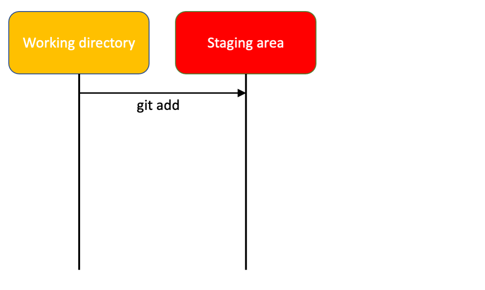

- Working directory er mappen slik den ser ut på maskinen din akkuratt nå
- Når du bruker `git add` på en fil, flyttes denne til "staging area". 
- Gjør du flere endringer på filen vil disse kun være i working directory inntill du bruker `git add` på dem
  
---

## Prøv å gjør noen endringer på `first.py`

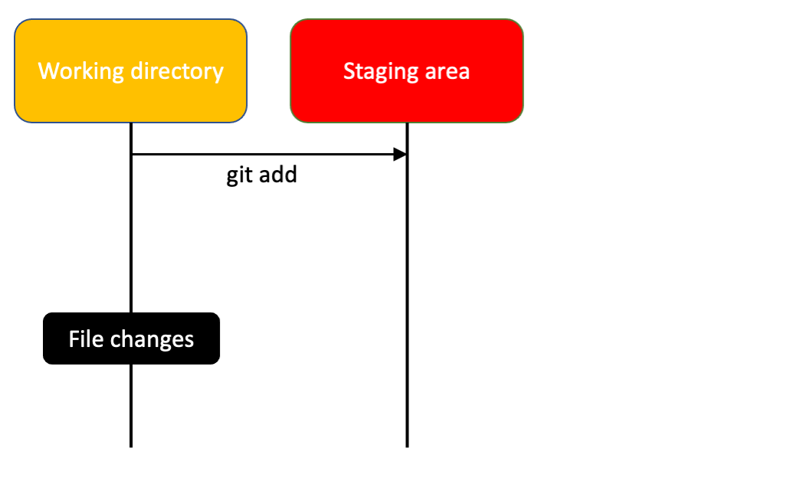
- Nå vil filen som du har i staging area være annerledes enn filen i working directory
- Working directory inneholder de nyeste endringene, mens staging area inneholder kun den versjon som du hadde når du brukte `git add`

---

```
$ git status
On branch master

No commits yet

Changes to be committed:
  (use "git rm --cached <file>..." to unstage)
        new file:   first.py

Changes not staged for commit:
  (use "git add <file>..." to update what will be committed)
  (use "git restore <file>..." to discard changes in working directory)
        modified:   first.py
```
---

## `git commit` for å legge til filen i repoet.
* Nå skal vi legge til en melding som beskriver hva vi har gjort

    ```
    git commit -m "La til first.py"
    git status
    ```

    Her går det også an å kun skrive `git commit`. Dette vil åpne en editor (default er mest sannsynelig vim eller nano). Dette kan du endre til for eksempel Visual studio code ved å skrive
    ```
    git config --global core.editor "code --wait"
    ```
    
* Alt som var av filer i "staging area" blir nå fjernet derfra igjen (vi hadde bare `first.py` der) og lagt til i historien til git repoet ditt.

---

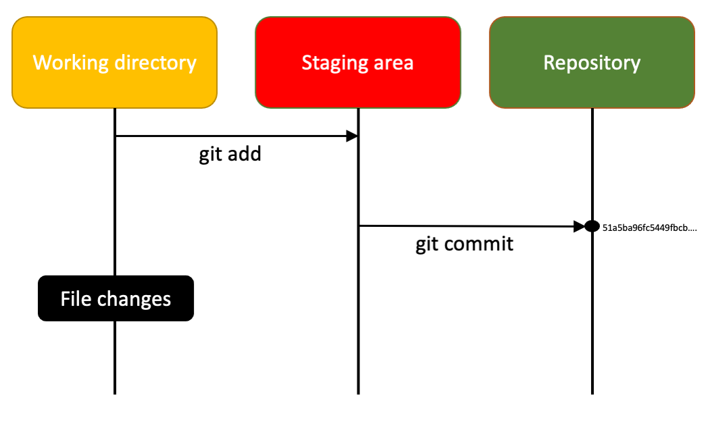

---

## Gjør noen flere endringer

- Gjør noen flere endringer til `first.py`
- Bruk `git status` for å se på tilstanden til repoet
- Hvordan kan vi forskaste endringene vi nettop har gjort?


---

## `git checkout` for å forkaste endringene i working directory

- `git checkout` brukes til veldig mye (kanskje litt for mye)
- En av tingene er å forkaste endringene i working directory
- Det finnes nå flere nye kommandoer som erstatter `git checkout`. I dette tilfelle `git restore`
- Hvis du vil legge til endringen så kan du bruke `git add`

---

## Komandoer så langt

* `git init` - lage nytt repo (vi skal se en annen enklerer måte når vi begynner med GitHub)
* `git status` - sjekker hvilke filer vi har / ikke har i repo, om noen filer er endret
* `git add` - Legg til fil i "Staging area"
* `git commit` - Lagre versjonen i "Staging area" i git historien med en melding som beskriver hva som ble gjort
* `git checkout` - Forkaster eventuelle endringer i working directory

---

## Se på tidligere commits

Vi kan se på historien ved å bruke kommandoen
```
git log
```

```
commit 51a5ba96fc5449fbcbf65d4c22832c12918a3ec9 (HEAD -> master)
Author: Henrik Finsberg <henriknf@simula.no>
Date:   Mon Aug 16 14:02:00 2021 +0200

    La til first.py
```

* `51a5ba96fc5449fbcbf65d4c22832c12918a3ec9 ` kalles hash. Dette er en unik kode for å identifisere committen.

---

* `Author: Henrik Finsberg <henriknf@simula.no>` - Dette har jeg lagt til i konfigurasjonen av git
    ```
    git config --global user.name "Henrik Finsberg"
    git config --global user.email henriknf@simula.no
    ```

* `Date:   Mon Aug 16 14:02:00 2021 +0200` - Tidspunkt for når jeg committa


* `La til first.py` - meldingen

* `HEAD -> master` - La oss ta dette (litt) senere

---


---
## En fil kan være i fire forskjellige tilstander

- Gjør noen endringer til `first.py` og utfør `git add`
- Gjør noen fler endringer
- Lag en ny fil `second.py` med noe kode

---

```
$ git status
On branch master
Changes to be committed:
  (use "git restore --staged <file>..." to unstage)
        modified:   first.py

Changes not staged for commit:
  (use "git add <file>..." to update what will be committed)
  (use "git restore <file>..." to discard changes in working directory)
        modified:   first.py

Untracked files:
  (use "git add <file>..." to include in what will be committed)
        second.py
```
---


## En fil kan være fire forskjellige tilstander

* `second.py` er ikke lagt til i git repoet ennå (Untracked)
  * Den ligger kun i "working directory"
* `fist.py` har tre forskjellig versjonen
  * Den versjonen vi sist committa (Repository)
  * Den versjonen vi "added"/"staged" (Staged)
  * Den versjonen vi akkurat endret (Working directory)


---

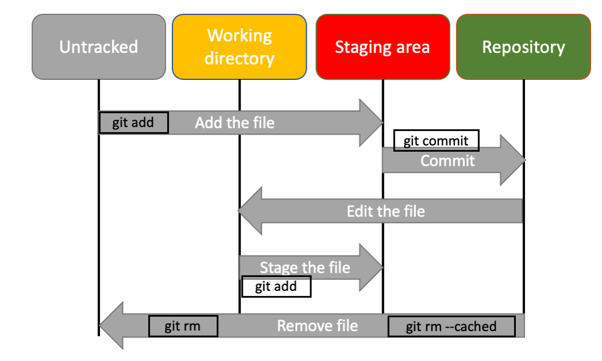

---

## Se på endringene
* Endringer mellom Working directory og Staging area
    ```
    git diff
    ```

* Endringer mellom Repoet og Staging area
    ```
    git diff --cached
    ```

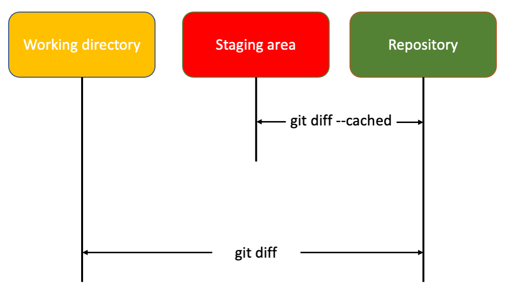

---

## Si nå at vi ønsker å gå tilbake til den versjonen av `first.py` i repoet

* Dersom du skriver `git status` vil den hjelpe deg med hvilke kommandoer du skal bruke

* La oss først forkaste endringene i working directory, og gå tilbake til kun "staged" versjon
* 
    ```
    git checkout first.py
    ```
    Nå har vi kun to versjoner av `first.py` (Repository og Staged)
* Merk: her kan du også bruke `git restore`
---

## Si nå at vi ønsker å gå tilbake til den versjonen av `first.py` i repoet

* For å gå tilbake til den original versjonen kan vi først skrive
    ```
    git reset HEAD first.py
    ```
    Dette flytter `first.py` ut av staging area. (Her kan man også bruke `git restore --staged first.py`)
    
* Nå finnes det fortsatt to versjoner av `first.py` (Unmodified og Working directory)
---

## Si nå at vi ønsker å gå tilbake til den versjonen av `first.py` i repoet

Til slutt kan vi gå tilbake til den originale versjonen ved å skrive
```
git checkout first.py
```
igjen

---

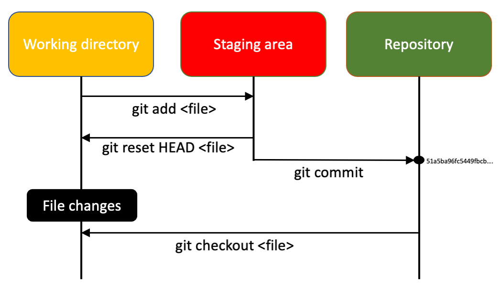

---

## Kontroll spørsmål
Har dere fulgt med? :) 

---
## Hva heter de fire tilstandene en fil kan være i?

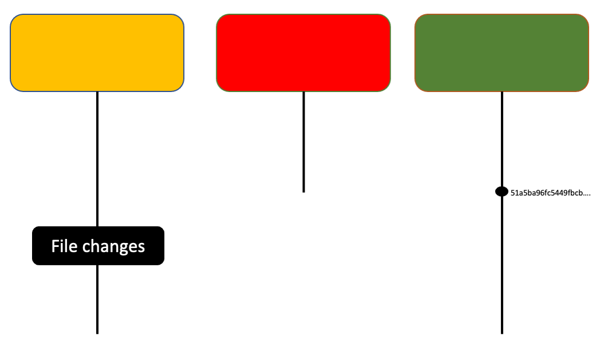

---

## Hva heter de fire tilstandene en fil kan være i?

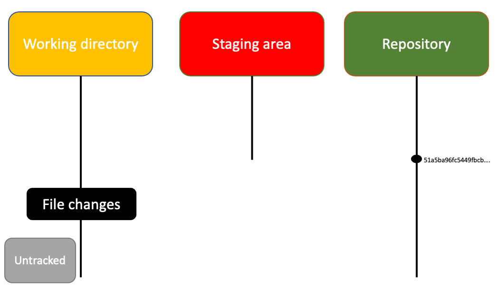

---

## Hva er kommandoen for å gå fra working directory til staging area?

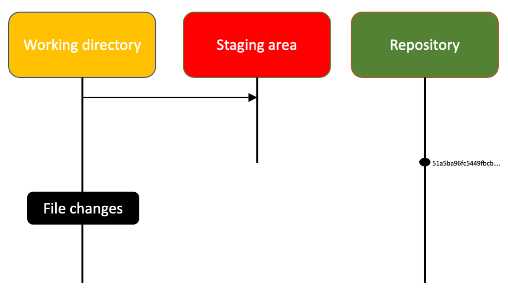

---

## Hva er kommandoen for å gå fra working directory til staging area?

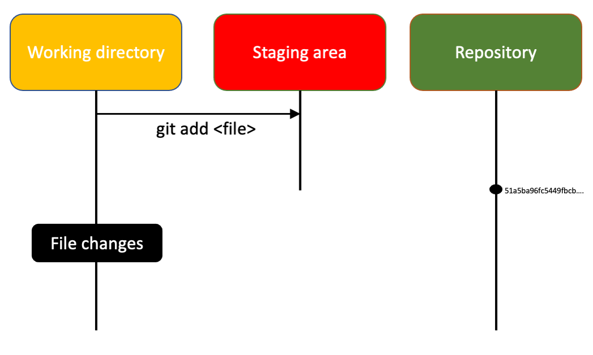

---

## Hva er det som er i denne røde boksen?

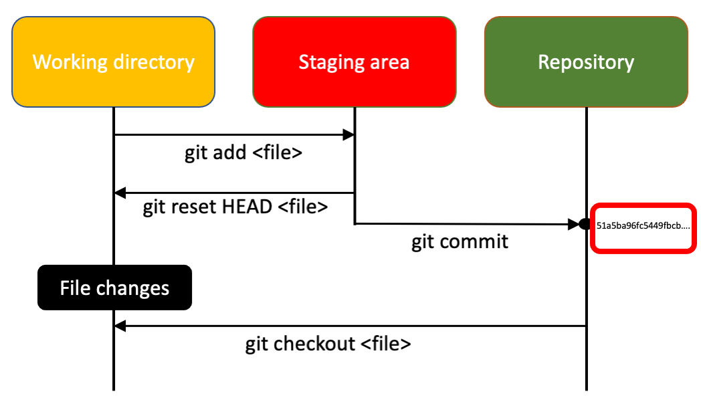


---


## Ignorere filer

* Noen ganger har vi filer i mappa vi jobber i som vi ikke bryr oss om

* Disse kan vi be git om å ignorere ved å legge til en fil som heter `.gitignore`

* For eksempel `__pycache__`

* Demo
  * Generer `__pycache__` ved å først importere `second` i `first.py`.
  * Ingorer så denne mappen i `git`

* https://www.gitignore.io


---

## Slette filer
* Lag en ny fil `third.py` med noe kode og legg den til repoet
* Prøv å slette filen. Er det mulig å få den tilbake? (Hint: prøv `git status`)
---

## Hvordan slette filer fra git?

* For å slette en fil fra git må vi bruke `git rm` 
    ```
    git rm thrid.py
    ```
    Dette vil også slette filen fra maskinen din (om du ikke allerede har gjort det)
    
* Dersom du kun ønsker å slette filen fra git men beholde filen på maskinen kan du skrive
    ```
    git rm --cached third.py 
    ```
---

## Hvordan finne tilbake til en fil som er slettet fra git?

* Slett `third.py` fra git. 
   ```
   git rm third.py
   git commit -m "Delete third.py"
   ``` 
* Hvordan kan vi få `third.py` tilbake nå?

* Sjekk om vi finner den i loggen (`git log`)

---

## Gå tilbake til en tidligere commit

* For å gå tilbake til en tidligere commit kan du bruke `git checkout <hash>`

* Hash verdien kan dere finne fra `git log`

* Prøv å gå tilbake til committen da vi la til `third.py` og se om vi klarere å gjenopprette `third.py`.

---

## Gå tilbake til den nyeste commiten

* For å gå tilbake til den nyeste commiten kan man du skrive

    ```
    git checkout master
    ```

    Mer om `master` og `HEAD` senere.

---

- Så langt har repoet vår kun eksistert på vår (lokale) egen maskin
- Men noe av det mest kraftfulle med `git` er at vi kan sammarbeide med andre
- Da trenger vi at repoet vår også kan synkroniseres med en (remote) server
- GitHub
- I tilegg til at GitHub lar deg sammarbeide med andre, så er det også en fin måte å lage backup av repoet ditt.
- Det finnes også andre servere enn GitHub for eksempel Bitbucket, Gitlab

---

## Sette opp ett git repository på GitHub

* Gjennom UiO så har alle en egen bruker på Github (https://github.uio.no)
    
* La oss sette opp ett repo på Github der vi skal largre repoet vi akkuratt lagde

* Tips: For å slippe å skrive passordet hver gang kan du enten lagre passordet eller sette opp SSH (https://docs.github.com/en/get-started/quickstart/set-up-git#next-steps-authenticating-with-github-from-git) 

---

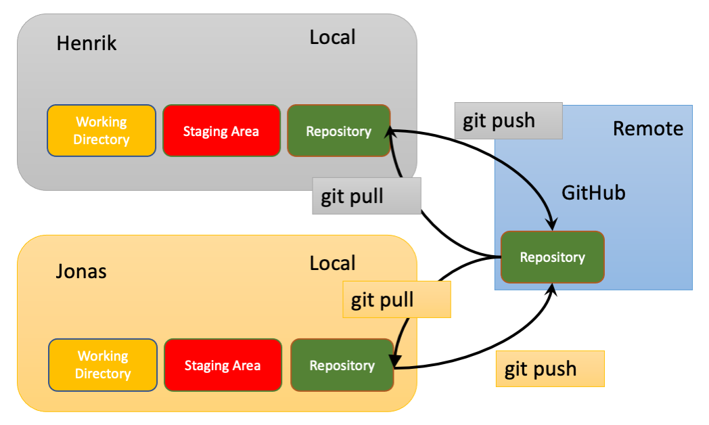


---

## Nå skal vi synkronisere vår lokale `git` repo med GitHub

- Det vi må gjøre er å legge til en `remote`
  ```
  git remote add <navn på remote>
  ```
- Standard navn på `remote` er `origin`
  ```
  git remote add origin
  ```
- Sjekk remote med 
  ```
  git remote -v
  ```

---

##  Nå skal vi synkronisere vår lokale `git` repo med GitHub


* For å synkronisere GitHub med dine lokale commits bruker du 
  ```
  git push <navn på remote> <navn på branch>
  ```
* Vi skal snakke om grener ("branch") senere men standard navn er "master"
  ```
  git push origin master
  ```
* I mange tilfeller kan du simpelthen kun bruke `git push`. Det vil pushe til den branchen du er på lokalt, og til den siste remote som du la til
* Merk at stort sett så har du kun en remote

---
 ## Legg til en fil og `push` den til GitHub


* Lag en fil `fourth.py` og push den til GitHub

---

## Klone et GitHub repo

* Stort sett bruker vi ikke `git init` + `git remote add origin`
* Istedet lager vi et repo på GitHub og kloner det

* La en ny mappe der du "kloner" repoet på GitHub slik at du får to versjoner av samme kode

    ```
    git clone <adress>
    ```
* Sjekk `git remote -v` for å se hva som er navnet på remoten

---

## Simulerer flere utviklere

* Legg til en ny fil `fifth.py`, push denne til GitHub.

* Du kan nå syknronisere det andre repoet ved å skrive 
  ```
  git pull origin master
  ```
* Også her kan du stort sett holde deg til `git pull`
  
---

## merge-konflikt

* Anta nå at to personer endrer på samme fil på samme sted.

* Den ene personen pusher sine endringer. Den andre må da pulle før den personen får lov til å pushe.

* Du vil da få det vi kaller en merge-konflikt (merge conflict).

* Simuler dette scenarioet

---

## Branching (forgreninger)

* I `git` har vi noe vi kaller forgreninger (branches)
* Forgreninger bruker vi når vi ønsker å utvikle noe nytt eller fikse en feil uten å ødelegge noe for andre
* Hovedgrenen kalles `master` (Dette er på vei til å bli byttet ut med `main`)

* List alle forgreninger som du har lokalt
    ```
    git branch
    ```
* For å liste forgreninger du har både lokalt og remote kan du bruke
    ```
    git branch -a 
    ```

---


Hver gang vi gjør en commit flyttes `master` til den nyeste committen
`HEAD` viser hvor vi er lokalt
  
---

## Lage en ny branch

* La oss lage en ny branch som vi kaller `testing`
    ```
    git branch testing
    ```
* Du kan sjekke at du har en ny branch ved å skrive `git branch`


---

## Starte å jobbe på branchen
* For å begynne å jobbe på en branch må vi først flytte `HEAD` til `testing`
    ```
    git checkout testing
    ```


---


## `git branch` + `git checkout` = `git checkout -b`

I stedet for å først lage en branch og deretter sjekke den ut, kan vi gjøre alt i en kommando
```
git checkout -b testing
```

---

## Hvordan kommer vi oss tilbake til `master` ? 

```
git checkout master
```

---

## Start å jobbe på branchen

* Sjekk at du er på branchen ved a skrive `git branch` eller `git status`
* Lag en fil som heter `test.py` og legg den til i repoet


---

## La oss pushe `testing` til GitHub (remote)
Prøv
```
git push
```
Denne funker ikke fordi GitHub ikke finner en branch `testing`. Istedenfor må vi skrive
```
git push --set-upstream origin testing
```
eller (ekvivalent)
```
git push -u origin testing
```

---

## Hva skjer om vi skriver
```
git checkout master
```
?


---

## Hva skjer om vi skriver
```
git checkout master
```
?


---

## La oss gjøre noen endringer på `master`
* Gjør en endring i `first.py` og legg til i repoet
* Lag deretter noen endringe i `first.py` på testing branchen
  


---

## Branch merging
* La oss si at vi nå er ferdig med arbeided på `testing` og ønsker å få endringene inn i master. 
* Husk `master` er hoved-forgreningen vår så vi ønsker at denne alltid skal fungere
* Vi skal gjøre dette ved å lage en pull request

---

## Lag en Pull Request

- En Pull Request (PR) er et verktøy som kan brukes til å fortelle andre hva du har endret og hvorfor
- I en Pull request kan man se over koden og komme med kommentarer og ha en diskusjon rundt endringene som er gjort
- Når noen ser over koden i en pull request kalles det for *code review*
- Du sender med andre ord en forespørslen (request) til utviklerene i GitHub repoet om at du skal pulle din branch inn en annen branch
- Lag en Pull Request hvor du ber om at `testing` skal merges inn i `master`

---

## Alternativ til pull request

###  `git merge` for kan brukes for å flette en branch inn i en annen

- Gå til `testing`
    ```
    git checkout testing
    ```
- Merge `master` inn i `testing`
    ```
    git merge `master`
    ```
Nå har `testing` fått endringene vi hadde på `master`

---

## Vi kan nå flette `testing` inn i `master` - men vi skal gjøre det ved en pull request istedet

- Vi kunne gjort 
    ```
    git checkout master
    git merge `testing`
    ```
- Men siden vi nå har et repo på GitHub skal vi lage en Pull Request.

- Push `testing` branchen til GitHub
    ```
    git push origin testing
    ```

---

## Ressurser

- https://github.uio.no/IN1910/IN1910_H21
- https://git-scm.com
    - Git Pro book (https://git-scm.com/book/en/v2)
- https://ericsink.com/vcbe/
- git-it (https://github.com/jlord/git-it-electron)
- https://guides.github.com/introduction/git-handbook/
- https://ohshitgit.com


---

- http://ndpsoftware.com/git-cheatsheet.html
- http://justinhileman.info/article/git-pretty/git-pretty.png
- Google
- Youtube
- `man git`
- `git --help`
- `git <command> --help` (for eksempel `git status --help`
