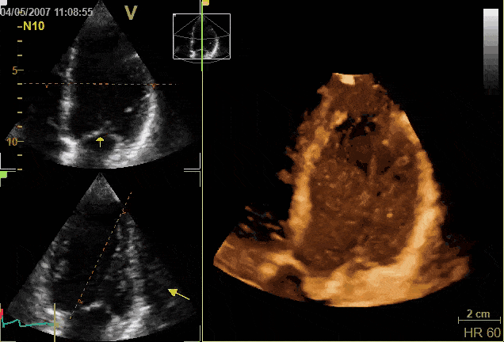
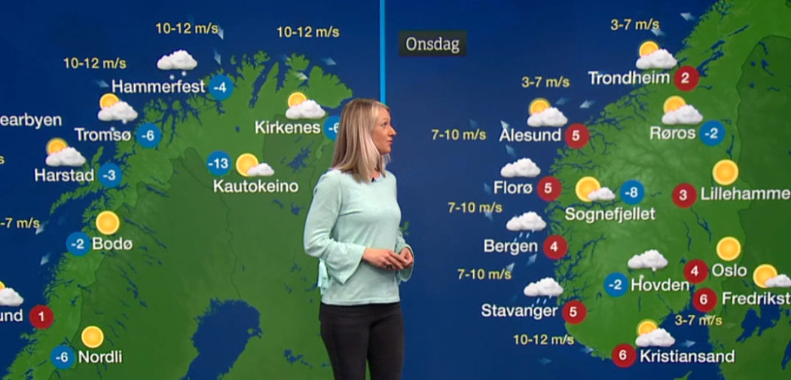

# Eksempler på naturvitenskapelige anvendelser

Henrik Finsberg - 26.08.21

---

I doktorgraden min jobbet med med å simulere hjertet til pasienter med hjertesvikt.

Dette arbeidet brukes nå til å se på hvor man best bør plassere elektrodene fra en pacemaker slik at hjertet får best mulig pumpe-effekt

---

Det er litt det samme man gjøre når man regner ut hvordan været skal bli i morgen. 

Man bruker målinger fra i dag, og finner en modell som passer godt med disse målingene.
Deretter ser man hva modellen predikerer av vær for morgendagen

---

Her ser dere en simulering av mitt eget hjerte. Fargene viser kreftene (eller spenningene) 

---

Nå om dagen jobber jeg med matematiske modeller for stamceller.

Man kan lage stamceller fra blod, og fra stam celler kan man lage andre celler (f.eks hjerteceller)

Målet er å bygge en modeller som kan brukes til å si om et medikament kan være farlig for hjertet ditt (f.eks medikamenter mot Covid-19)

---
