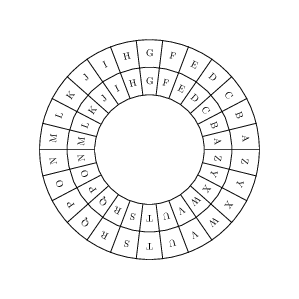
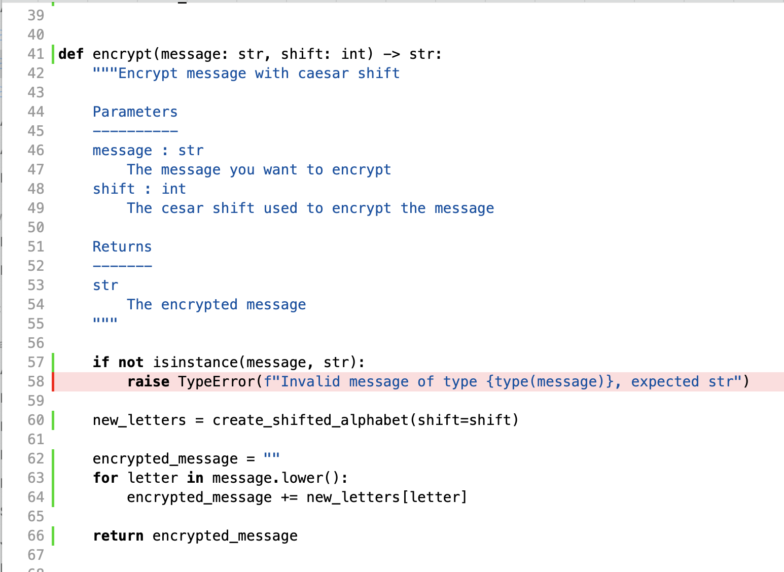
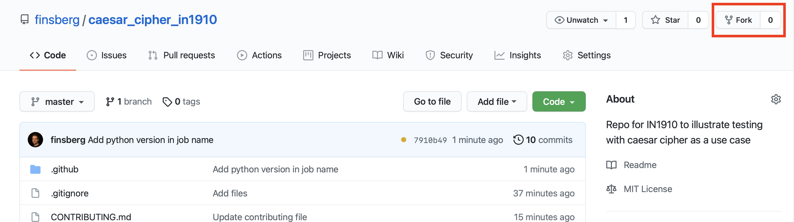

# Lecture 3 and 4 - Testing og Feilhåndtering
Henrik Finsberg - 31.08.21

---

Dette er et Zoom opptak og alle spørsmål fra deltagere blir en del av opptaket. De som ikke ønsker dette bør slå av sin mikrofon og video. De kan bruke chat-funksjonene, den blir ikke lagret. Opptaket blir lagret inntil videre og skal brukes i undervisning. Opptaket legges ut på semestersiden og vil være tilgjengelig for alle. Hjemmelsgrunnlag for behandlingen er personvernforordningen art. 6 nr. 1 bokstav e, jf. universitets og høyskoleloven § 1-3

---

## Plan for dagens forelesning

- Hvorfor testing?
- Praktisk eksempel - implementere en krypteringsalgoritme ved å bruke test dreven utvikling
- Feilhåndtering
- Automatiserte tester på GitHub

---


## Feil i kode kan føre til økonomiske tap og i værste fall tap av menneskeliv

- I 1998 sendte NASA ut et fartøy til Mars for å studere klimaet på Mars
- De mistet kontakt med fartøyet fordi det var en faktor 4.65 feil i banen til fartøyet
- Det er den samme faktoren som brukes til å konvertere mellom meter og feets
- Kostnaden for denne feilen var estimert til 327.6 millioner dollar
  
---

## Hvorfor testing?


- Vi ønsker å vite at koden gjør som vi forventer
  - Sjekk at en gitt input gir forventet output
- Vi ønsker å teste "edge cases" som utforderer koden vår
  - Hvis andre skal bruke koden, hva kan de finne på å gjøre?
- Vi ønsker å sørge for at koden er stabil og feiler kontrolert dersom noen bruker den feil
  - Gi tydelige feilmeldinger
  - Hvis en komponent som feiler er del av et større system ønsker vi ikke at hele systemet går ned på grunn av feil i en liten komponent.
---

## Når vi lager tester må vi ofte kunne tenke på alle mulige måter som andre kan tenke seg å bruke koden

- Derfor har større bedrifter ofte egne folk (QA - Quality assurance ingeniører) som kun driver med testing
- Men det er ikke alltid lett å vite hva som er reelle tester

  *A QA engineer walks into a bar. Orders a beer. Orders 0 beers. Orders 99999999999 beers. Orders a lizard. Orders -1 beers. Orders a ueicbksjdhd.*

  *First real customer walks in and asks where the bathroom is. The bar bursts into flames, killing everyone.*

---

## Testing gjør at vi kan slippe å tenke på at vi innfører bugs i koden

- Dersom koden er godt testet kan vi være mer kreative og "uforsiktige" når vi utvikler fordi testene vil si ifra om vi gjør noe galt
- Dette gjør at vi kan utvikle kode raskere


---

## Test dreven utvikling (TDD)

- Du ønsker å implemetere en ny funksjonalitet
- Skriv en test som tester funksjonaliteten du ønsker å implementere
- Implementer det ønskede funksjonaliteten
- Sørg for at testen passerer
  
---

## Praktisk eksempel
- Implementering av Cæsarchiffer
- Du velger et shfit (nøkkel) og shifter alfabetet samme antall plasser
- Dette gir det en nytt rotert alfabet
- Bytt ut alle bokstaver med bokstavene i det nye alfabetet
- https://cryptii.com/pipes/caesar-cipher



---

```python
>> shift = 1
>> msg = "hello"
>> encrypted_message = encrypt(msg, shift=shift)
>> print(encrypted_message)
ifmmp
```

---

- Lag en module `caesar_cipher.py` og en test fil `test_caesar_cipher.py`
- Implementer metoder for å kryptere og dekryptere meldinger ved å bruke test dreven utvikling

---

## `pytest` er et testing rammeverk

- `pytest` vil lete etter filer som inneholder `test` i navnet og kjøre alle funksjoner i de filene som starter med `test`
- `pytest` lar deg
  - Kjøre kun et utvalg at testene
  - Parameterisere testene
  - Teste at exceptions blir kastet
  - og mye mer...

---

## Kjøre `pytest`

For å kjøre `pytest`

```
python -m pytest test_caesar_cipher.py
```

eller

```
python -m pytest
```

eller 
```
pytest
```

---

## Kjøre en spesifik test
For å kun kjøre en spesifikk test

```
python -m pytest test_caesar_cipher.py -k test_encrypt
```
Merk at dette vil kjøre alle tester som starter med `test_encrypt` (dvs også funksjonen som heter `test_encrypt_hello`)

---

## Sku på printing

`pytest` skur av printing når det kjører. Det vil si at selv om du skriver `print` i koden vil ikke dette vises når du kjører testene. Du kan skru av dette ved å bruke `-s` flagget, for eksempel
```
python -m pytest test_caesar_cipher.py -s
```

---

## Debugging av tester

Når man skriver tester kan man fort ende opp med å ikke forstå hvorfor noe ikke fungerer.
Da er det fint å sette et `breakpoint` rett før det skjer noe rart. 
Dette gjøres ved å skrive `breakpoint()` i koden.
Dersom du bruker python3.6 eller eldre, må du skrive `import pdb; pdb.set_trace()`


---

## Parameteriserte tester

- Når man skriver tester er det fort gjort å repetere seg selv

    ```python
    def test_encrypt_hello():
        assert test_encrypt("hello", shift=1) == "ifmmp"

    def test_encrypt_welcome():
        assert test_encrypt("welcome", shift=7) == "dlsjvtl"
    ```

- Dette kan vi refakturere i en funksjon
    ```python
    def test_encrypt(msg, shift, expected_output):
        assert test_encrypt(msg, shift=shift) == expected_output

    ```

---

## Parameteriserte tester

- Nå kan vi teste flere tilfeller med å lage en loop
  ```python
  for msg, shift, expected_output in [
        ("hello", 1, "ifmmp"),
        ("welcome", 7, "dlsjvtl"),
    ]:
        test_encrypt(msg, shift, expected_output)
  ```

---

## Parameteriserte tester i `pytest`

- Måten vi gjøre dette i `pytest` er ved å bruke noe som kalles en dekorator
  ```python
  @pytest.mark.parametrize(
        "msg, shift, expected_output", [("hello", 1, "ifmmp"), ("welcome", 7, "dlsjvtl")]
    )
    def test_encrypt(msg, shift, expected_output):
        assert caesar_cipher.encrypt(msg, shift=shift) == expected_output
  ```
- `@pytest.mark.parametrize` kalles en dekorator. 
- Vi sier av vi dekorerer `test_encrypt` med funksjonen `pytest.mark.parametrize`, som betyr at istedet for å bruke `test_encrypt` så bruker vi `pytest.mark.parametrize(test_encrypt)`

---

## Kjøre parameteriserte tester i `pytest`

Dersom vi kjører testene nå ser vi at vi før nyttig output
```
$ python -m pytest test_caesar_cipher.py -k test_encrypt -v
========================================= test session starts ==========================================
platform darwin -- Python 3.9.6, pytest-6.2.4, py-1.10.0, pluggy-0.13.1 -- /Users/henriknf/miniconda3/envs/IN1910/bin/python
cachedir: .pytest_cache
rootdir: /Users/henriknf/local/src/IN1910/IN1910_dev/book/docs/slides/L03
plugins: cov-2.12.1, anyio-3.3.0
collected 14 items / 12 deselected / 2 selected                                                        

test_caesar_cipher.py::test_encrypt[hello-1-ifmmp] PASSED                                        [ 50%]
test_caesar_cipher.py::test_encrypt[welcome-7-dlsjvtl] PASSED                                    [100%]

=================================== 2 passed, 12 deselected in 0.03s ===================================
```

---

## Refakturering

- Refakturering (engelsk: refactoring) er prosessen å gå over og skrive om / forbedre koden slik at koden blir lettere å forstå, vedlikeholde og teste men fortsatt gjør det samme
- Refakturer testene slik at vi bruker parametriserte tester

---

## Noen tester koden din og prøver å kryptere ordet `Hei`

Dette gir en feilmelding
```
Traceback (most recent call last):
  File "/Users/henriknf/local/src/IN1910/IN1910_H21/book/docs/slides/L03/caesar_cipher.py", line 85, in <module>
    encrypt("Hei", 6)
  File "/Users/henriknf/local/src/IN1910/IN1910_H21/book/docs/slides/L03/caesar_cipher.py", line 61, in encrypt
    encrypted_message += new_letters[letter]
KeyError: 'H'
```
---

Sørg for å konvertere alt til små bokstaver først

---

## Noen andre prøver å bruke koden til å kryptere ett tall

```
Traceback (most recent call last):
  File "/Users/henriknf/local/src/IN1910/IN1910_H21/book/docs/slides/L03/caesar_cipher.py", line 85, in <module>
    encrypt(1910, 4)
  File "/Users/henriknf/local/src/IN1910/IN1910_H21/book/docs/slides/L03/caesar_cipher.py", line 60, in encrypt
    for letter in message.lower():
AttributeError: 'int' object has no attribute 'lower'
```

---

## Vi ønsker kun at brukeren gir oss strenger

- Sjekk at input er en streng og gi beskjed om at vi kun aksepterer strenger
- Man kan bruke `isinstance` til å sjekke typen til en variable
  ```python
  if not isinstance(message, str):
    print(f"Invalid message of type {type(message)}, expected str")
  ```

---

## I tilfeller hvor det skjer en feil er det riktig å kaste et exception

Vi kaster exceptions ved å bruke `raise` etterfulgt av et exception

```python
if not isinstance(message, str):
    raise TypeError(f"Invalid message of type {type(message)}, expected str")
```
`TypeError` er et innebygd exception to kan ta en streng som inneholder mer info om hva som foråsakte feilen

---

## Python har mange innebygde exceptions

https://docs.python.org/3/library/exceptions.html#exception-hierarchy

---

## Vi kan fange et exception ved å bruke `try` - `except`

Slik kan selv håndtere hva som skjer om noe går galt
```python

try:
    encrypt(1910, 4)
except TypeError:
    print("Something is wrong")

```

---

## Vi kan også printe infomasjonen som ble sendt i feilmeldingen

```python
try:
    encrypt(1910, 4)
except TypeError as ex:
    print("Something is wrong")
    print(ex)
```

---

## Hvis du ikke vet hvilket exception to skal fange kan du bruke `Exception`

```python
try:
    encrypt(1910, 4)
except Exception as ex:
    print("Something is wrong")
    print(ex)
```


---

## Men det er god praktisk å handtere ulike exceptions hver for seg

```python
try:
    encrypt(1910, 4)
except TypeError as ex:
    print("Wrong type")
    print(ex)
except Exception as ex:
    print("Something else went wrong")
    print(ex)
```

--- 

## Det er ofte også en god ide å lage egne exceptions

* 
    ```python
    class InvaildMessageType(TypeError):
        pass
    ```

* 
  ```python
  if not isinstance(message, str):
        raise InvaildMessageType(
            f"Invalid message of type {type(message)}, expected str"
        )
  ```

---

## Hva blir printet dersom vi bruker vår egen Exception klasse?

```python
try:
    encrypt(1910, 4)
except TypeError as ex:
    print("Wrong type")
    print(ex)
except Exception as ex:
    print("Something else went wrong")
    print(ex)
```

---

## Exceptions og arv

- Hvis du fanger exceptions fra en klasse, fanger du også exception fra alle klasser som arver fra den exception klassen.

- Nesten alle exceptions arver fra `Exception`, se https://docs.python.org/3/library/exceptions.html#exception-hierarchy

- Merk: Du må ikke fange `BaseException`. Hva vil for eksempel skje her:

    ```python
    import time

    while True:
        try:
            print("Try something")
            time.sleep(2)
        except BaseException:
            print("Something went wrong")
    ```

---

## `try` - `except` - `else` - `finally`

```python
try:
    # Kode som kan kaste exceptions
except Exception:
    # Håndter hva som skjer om exception blir kastet
else:
    # Håndter hva som skal skje om alt går bra
finally:
    # Gjør dette til slutt uansett - rydd opp

```

---

## Har vi testet all koden, eller finnes det noen del av koden som ikke er testet?

Vi kan bruke `pytest-cov` til å sjekke. Du kan installere det ved å bruke `python -m pip install pytest-cov` eller `conda install -y pytest-cov`. Deretter kan vi sende med `--cov` flaget


```
$ python -m pytest test_caesar_cipher.py --cov                     
====================================================== test session starts ======================================================
platform darwin -- Python 3.9.6, pytest-6.2.4, py-1.10.0, pluggy-0.13.1
rootdir: /Users/henriknf/local/src/IN1910/IN1910_dev/book/docs/slides/L03
plugins: cov-2.12.1, anyio-3.3.0
collected 18 items                                                                                                              

test_caesar_cipher.py ..................                                                                                  [100%]

---------- coverage: platform darwin, python 3.9.6-final-0 -----------
Name                    Stmts   Miss  Cover
-------------------------------------------
caesar_cipher.py           20      1    95%
test_caesar_cipher.py      23      2    91%
-------------------------------------------
TOTAL                      43      3    93%


====================================================== 18 passed in 0.10s =======================================================
```

---

## Vi kan også spesifisere hvilken fil vi ønsker å sjekke

```
$ python -m pytest test_caesar_cipher.py --cov=caesar_cipher       
====================================================== test session starts ======================================================
platform darwin -- Python 3.9.6, pytest-6.2.4, py-1.10.0, pluggy-0.13.1
rootdir: /Users/henriknf/local/src/IN1910/IN1910_dev/book/docs/slides/L03
plugins: cov-2.12.1, anyio-3.3.0
collected 18 items                                                                                                              

test_caesar_cipher.py ..................                                                                                  [100%]

---------- coverage: platform darwin, python 3.9.6-final-0 -----------
Name               Stmts   Miss  Cover
--------------------------------------
caesar_cipher.py      20      1    95%
--------------------------------------
TOTAL                 20      1    95%


====================================================== 18 passed in 0.08s =======================================================
```

---

## Vi kan se hvilke linjer som ikke er dekket av testene

```
$ python -m pytest test_caesar_cipher.py --cov=caesar_cipher --cov-report term-missing
====================================================== test session starts ======================================================
platform darwin -- Python 3.9.6, pytest-6.2.4, py-1.10.0, pluggy-0.13.1
rootdir: /Users/henriknf/local/src/IN1910/IN1910_dev/book/docs/slides/L03
plugins: cov-2.12.1, anyio-3.3.0
collected 18 items                                                                                                              

test_caesar_cipher.py ..................                                                                                  [100%]

---------- coverage: platform darwin, python 3.9.6-final-0 -----------
Name               Stmts   Miss  Cover   Missing
------------------------------------------------
caesar_cipher.py      20      1    95%   58
------------------------------------------------
TOTAL                 20      1    95%


====================================================== 18 passed in 0.08s =======================================================
```

Vi ser at testene våre ikke kjører linje 58

---

## Vi kan også få en bedre visuell representasjon av hvikle linjer som mangler ved å bruke `--cov-report html`

Da vil du få en ny mappe som heter `htmlcov`, og hvis du åpner `htmlcov/index.html` så får du se mer info og du kan trykke på de ulike filene



---

## Teste at koden gir korrect feilmelding

- Vi ønsker nå å teste at dersom brukeren gir inn en variabel av typen `int` til `encrypt` så kastes det et TypeError exception
- Da vil vi også få 100% test dekning (test coverage)
  

```python
def test_encrypt_raises_TypeError_on_int_input():
    try:
        caesar_cipher.encrypt(1910, 4)
    except TypeError:
        # Correct exception is raised, test should pass
        pass
    except Exception:
        # This catches any other type of exception, test should fail
        raise Exception
    else:
        # No exception has been raised, test should fail
        raise Exception
```

---

## I `pytest` kan vi bruke `pytest.raises`

```python
with pytest.raises(TypeError):
    caesar_cipher.encrypt(1910, 4)
```
En `with`-block kalles også en context manager. Slike context managers brukes ofte der man ønsker en midlertid forandring, eller der man ønsker å arbeide med resurser som må frigjøres (for eksempel når man jobber med filer)

---

## Automatiserte tester

Sett opp GitHub actions slik at testene kjører hver gang noen pusher eller lager en pull request til repoet

https://github.com/finsberg/caesar_cipher_in1910

---

## Har du noen forslag til forbedringer?

Lag en fork av repoet mitt og submit en pull request :)



---

# Kode fra forelesningen

```python
# caesar_cipher.py
from typing import Dict

ALPHABET = "abcdefghijklmnopqrstuvwxyz"


class InvaildMessageType(TypeError):
    pass


def rotate_string(msg: str, shift: int) -> str:
    return msg[shift:] + msg[:shift]


def create_shifted_alphabet(shift: int) -> Dict[str, str]:
    """Given a shift return a dictionary with the
    shifted alphabath

    Example
    -------
    >> new_letters = create_shifted_alphabet(shift=1)
    >> print(new_letters)
    new_letters = {"a": "b", "b": "c", ...}

    Parameters
    ----------
    shift : int
        The number of places to shift the alphabet

    Returns
    -------
    Dict[str, str]
        Dictionary with the original alphabet as keys and
        the new letters as values
    """

    new_letters = {}
    rotated_alphabet = rotate_string(ALPHABET, shift=shift)

    for letter, new_letter in zip(ALPHABET, rotated_alphabet):
        new_letters[letter] = new_letter

    return new_letters


def encrypt(message: str, shift: int) -> str:
    """Encrypt message with caesar shift

    Parameters
    ----------
    message : str
        The message you want to encrypt
    shift : int
        The cesar shift used to encrypt the message

    Returns
    -------
    str
        The encrypted message
    """

    if not isinstance(message, str):
        raise InvaildMessageType(
            f"Invalid message of type {type(message)}, expected str"
        )

    new_letters = create_shifted_alphabet(shift=shift)

    encrypted_message = ""
    for letter in message.lower():
        encrypted_message += new_letters[letter]

    return encrypted_message


def decrypt(encrypted_message: str, shift: int) -> str:
    """Decrypt the encypted message using ceaser shift

    Parameters
    ----------
    encrypted_message : str
        The message that should be decrypted
    shift : int
        The ceasr shift

    Returns
    -------
    str
        Deacrypted message
    """
    return encrypt(encrypted_message.lower(), -shift)

```

```python
# test_caesar_cipher.py
# https://cryptii.com/pipes/caesar-cipher

import pytest
import caesar_cipher


@pytest.mark.parametrize(
    "msg, shift, expected_output", [("hello", 1, "ifmmp"), ("welcome", 7, "dlsjvtl")]
)
def test_encrypt(msg, shift, expected_output):
    assert caesar_cipher.encrypt(msg, shift=shift) == expected_output


@pytest.mark.parametrize(
    "encrypted_msg, shift, expected_output",
    [("ifmmp", 1, "hello"), ("dlsjvtl", 7, "welcome")],
)
def test_decrypt(encrypted_msg, shift, expected_output):
    assert caesar_cipher.decrypt(encrypted_msg, shift=shift) == expected_output


@pytest.mark.parametrize(
    "msg, shift",
    [
        ("programming", 3),
        ("math", 15),
        ("physics", -18),
        ("Hei", 6),
    ],
)
def test_encrypt_decrypt_yields_same_result(msg, shift):
    encrypted_message = caesar_cipher.encrypt(message=msg, shift=shift)
    decrypted_message = caesar_cipher.decrypt(
        encrypted_message=encrypted_message, shift=shift
    )
    assert decrypted_message == msg.lower()


def test_encrypt_raises_TypeError_on_int_input():
    with pytest.raises(TypeError):
        caesar_cipher.encrypt(1910, 4)


@pytest.mark.parametrize(
    "letter, new_letter, shift",
    [
        ("a", "b", 1),
        ("m", "n", 1),
        ("z", "a", 1),
        ("a", "f", 5),
        ("m", "r", 5),
        ("z", "e", 5),
        ("a", "a", 26),
        ("m", "m", 26),
        ("z", "z", 26),
    ],
)
def test_create_shifted_alphabet(letter, new_letter, shift):
    new_letters = caesar_cipher.create_shifted_alphabet(shift)
    assert new_letters[letter] == new_letter


def test_rotate_string():
    assert caesar_cipher.rotate_string("hello", 1) == "elloh"
    assert caesar_cipher.rotate_string("hello", 2) == "llohe"
```